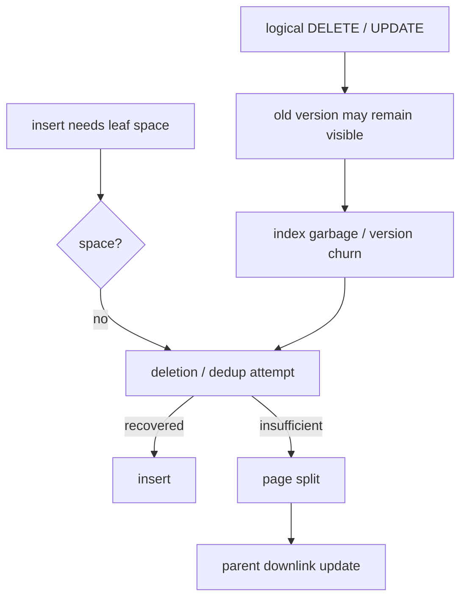

# B+Tree Deletion, MVCC Garbage, Deduplication ve Fillfactor

## Temel fikir
Klasik B+Tree deletion, minimum occupancy bozulunca sibling'den redistribution/borrow veya merge ile yapısal invariant'ı korur. Production MVCC database engine'inde logical row deletion ile physical index reclamation aynı an değildir. Active snapshots eski version'ları görünür tutabilir; engine güvenli olduğunda garbage index tuple'larını temizler.

## Textbook deletion invariant
- Leaf/internal page occupancy belirli minimumun altına inerse önce sibling redistribution düşünülebilir.
- Redistribution mümkün değilse sibling merge edilir ve parent separator/downlink güncellenir.
- Parent da underflow olursa işlem yukarı doğru ilerleyebilir.
- Root özel durumdur; tek child kalması height shrink'e yol açabilir.

## PostgreSQL MVCC gerçekliği
PostgreSQL B-Tree, index tuple'ını yalnız logical row kimliği olarak değil physical tuple version pointer'ı olarak taşır. UPDATE-heavy workload'da aynı logical row için version churn oluşabilir. PostgreSQL 18'de bottom-up index deletion, version-churn kaynaklı beklenen page split öncesinde targeted leaf cleanup yaparak split'i önlemeye çalışabilir. Simple index tuple deletion ise daha önce scan tarafından `LP_DEAD` olarak işaretlenen güvenli tuple'ları opportunistic temizleyebilir.

## Deduplication
Duplicate key'ler posting-list representation ile bir key + birden fazla TID biçiminde sıkıştırılabilir. Bu storage ve scan maliyetini düşürebilir ve bazı split'leri geciktirebilir. PostgreSQL'de dedup default olarak açıktır fakat tüm index biçimlerinde güvenli/uygulanabilir değildir; `INCLUDE` kullanılan B-Tree index'lerde dedup uygulanmaz.

## Fillfactor
Fillfactor page üzerinde future mutation için bırakılan headroom ile mevcut storage/cache density arasında trade-off yaratır. Mutable workload'da %100 fillfactor küçük sayıda insert/update ile split dalgasına yol açabilir. Daha düşük fillfactor ise daha fazla page, storage ve cache footprint maliyeti yaratabilir.

## Mülakat soruları
- B+Tree underflow'da borrow ve merge nasıl çalışır?
- Logical deletion ile physical reclamation neden ayrılır?
- Long-running snapshot index cleanup'ı nasıl etkileyebilir?
- Bottom-up deletion neden anticipated split ile ilişkilidir?
- Dedup hangi workload'da faydalıdır?
- Fillfactor nasıl seçilir?
- Staff/Principal: bloat, update churn, vacuum ve latency sinyallerini nasıl birlikte yorumlarsın?

## Production failure modes
- Long transaction/snapshot reclamation horizon'ını geride tutabilir.
- High fillfactor mutable workload'da page-split pressure yaratabilir.
- Çok düşük fillfactor storage/cache efficiency'yi düşürür.
- Version churn scan'in aynı logical row için daha fazla physical version görmesine neden olabilir.
- Bloat teşhisinde yalnız index byte size değil query latency, buffer I/O, update rate ve vacuum davranışı birlikte incelenmelidir.

## Mini lab
Indexed bir PostgreSQL tablosunda update-heavy workload üret. İki fillfactor ile index size, throughput ve `EXPLAIN (ANALYZE, BUFFERS)` ölç. Uzun snapshot açarak deneyi tekrarla; VACUUM sonrası farkı kaydet.

## Kaynaklar
- PostgreSQL 18 — B-Tree indexes: https://www.postgresql.org/docs/18/btree.html
- PostgreSQL 18 — CREATE INDEX: https://www.postgresql.org/docs/18/sql-createindex.html
