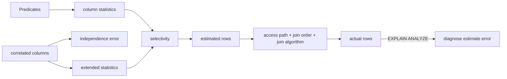

# Cardinality Estimation, Histograms & Extended Statistics

**Seviye:** Mid → Principal

## Konu anlatımı
Query optimizer fiziksel plan seçerken ara operatörlerin kaç satır üreteceğini tahmin eder. Cardinality estimation (CE), access path, join order, join algorithm ve memory kararlarının temel girdisidir. Küçük bir selectivity hatası plan ağacında çarpılarak büyük runtime farkına dönüşebilir.

PostgreSQL `ANALYZE` ile örnekleme yapar; `null_frac`, `n_distinct`, most-common-values/frequencies ve histogram bounds gibi özetler üretir. Equality predicate MCV/distinct bilgisinden, range predicate histogramdan yararlanabilir. Tek kolon istatistiklerinin önemli kör noktası correlated columns'dır: bağımsızlık varsayımı `city='Istanbul' AND country='TR'` gibi predicate'lerde ciddi hata üretebilir. `CREATE STATISTICS` functional dependencies, multivariate distinct counts ve multivariate MCV ile bu kör noktayı azaltabilir.

## Mental model
Optimizer verinin kendisini değil, **sıkıştırılmış istatistiksel bir haritayı** görür. Kötü CE, executor'a verilen yanlış yol tarifidir.

## İçeride ne oluyor?
1. `ANALYZE` sample alıp column statistics üretir.
2. Planner predicate selectivity tahmin eder.
3. Estimated rows cost modeline akar.
4. Çoklu predicate'lerde bağımsızlık varsayımı correlation yüzünden bozulabilir.
5. Extended statistics seçili kolon grupları için ek bilgi sağlar.
6. `EXPLAIN (ANALYZE, BUFFERS)` estimated-vs-actual farkını görünür kılar.

## Mülakat soruları
- Cardinality estimation neden join order için kritiktir?
- MCV ile histogram neyi farklı çözer?
- Correlated predicate'lerde independence assumption nasıl hata üretir?
- Estimated rows 100, actual 1M ise hangi root-cause sırasıyla bakarsın?
- Statistics target'ı her kolonda yükseltmek neden iyi fleet policy değildir?
- Multi-tenant skew ve parameter sensitivity nasıl gözlemlenir?

## Beklenen cevap seviyesi
- **Mid:** selectivity, histogram, MCV, estimated-vs-actual.
- **Senior:** skew, stale stats, correlation, extended statistics ve join-order etkisi.
- **Staff:** workload-specific statistics policy ve plan-regression detection.
- **Principal:** upgrade/optimizer rollout, workload replay, SLO/cost gate ve rollback.

## Mini alıştırma
10M satırda `country='TR'` %10 ve `city='Istanbul'` %4 olsun; Istanbul satırlarının tamamı TR içinde olsun. Independence tahminini gerçek 400k ile karşılaştır ve hangi extended-statistics türünün yardımcı olabileceğini tartış.

## Proje fikri
**ce-lab:** correlated ve skewed dataset üret; `pg_stats`, `EXPLAIN (ANALYZE, BUFFERS)` ve `CREATE STATISTICS` öncesi/sonrası estimated/actual ratio, plan, runtime ve buffer reads'i karşılaştır.

## Failure modes / trade-off / production
Stale statistics, rare values, data skew, correlated columns ve parameter sensitivity kötü CE üretir. Daha yüksek statistics target daha fazla ANALYZE/catalog maliyeti getirir ve tüm correlations'ı çözmez. Estimated/actual ratio, plan changes, query p95/p99, spills, buffer reads ve analyze freshness birlikte izlenmelidir.

## Kaynaklar
- PostgreSQL 18 — Planner Statistics: https://www.postgresql.org/docs/18/planner-stats.html
- PostgreSQL 18 — CREATE STATISTICS: https://www.postgresql.org/docs/18/sql-createstatistics.html
- PostgreSQL 18 — EXPLAIN: https://www.postgresql.org/docs/18/using-explain.html
