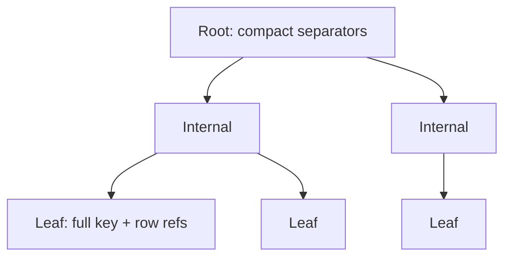

# B+Tree Separator Keys, Suffix Truncation, Fanout & Height

## Konu anlatımı
B+Tree performansı yalnız `O(log n)` değildir; page boyutu, internal tuple width, fanout, height ve cache/I/O davranışı belirleyicidir. Internal separator key'in işi row temsil etmek değil doğru child page'e yönlendirmektir. Bu nedenle separator için gerekmeyen trailing key parçaları bazı storage engine'lerde atılabilir.

PostgreSQL B-Tree split sırasında parent için pivot tuple üretir. Suffix truncation multicolumn key'in routing için gereksiz suffix attribute'larını kaldırarak internal tuple'ı küçültebilir. Daha küçük tuple → daha fazla downlink/page → daha yüksek fanout → height artış eşiğinin ötelenmesi. Leaf deduplication farklıdır: duplicate leaf tuples posting list biçiminde birleştirilir.

Yaklaşık model: `fanout ≈ usable_page_bytes / avg_internal_entry_bytes`; `height ≈ ceil(log_fanout(N_leaf_pages))`. Bu yalnız capacity mental modelidir; gerçek page header/line pointer/fill/split ayrıntıları ayrıca hesaba katılır.

## Mental model

## İçeride ne oluyor?
- Search separator/pivot key ile child seçer.
- Leaf dolunca split ve parent downlink oluşur.
- Separator yalnız routing için gerekli key prefix'ini taşıyabilir.
- Internal entry küçülürse fanout artar.
- Root split yeni level ekler.
- Composite key width cache residency ve height üzerinde fiziksel sonuç doğurabilir.

## Mülakat soruları
1. B+Tree'nin yüksek fanout'u neden önemlidir?
2. Separator key ile leaf key farkı nedir?
3. Suffix truncation ile leaf deduplication farkı?
4. Page size ve internal entry width fanout'u nasıl belirler?
5. Geniş composite index read/write maliyetini nasıl değiştirir?
6. Covering index ile cache/write amplification arasında nasıl karar verirsin?

## Beklenen cevap derinliği
**Junior:** page tabanlı tree ve internal/leaf ayrımı. **Mid:** fanout/height/separator. **Senior:** split, pivot tuple, suffix truncation ve cache/I/O. **Staff/Principal:** workload, index width, write amplification, latency SLO ve capacity economics.

## Mini alıştırma
8 KiB usable page için 64-byte ve 32-byte internal entry ile kaba fanout'u hesapla; 1 milyon leaf page'de internal level sayısını karşılaştır.

## Proje fikri
`btree-fanout-lab`: PostgreSQL'de geniş composite index kur; `pageinspect`, index size, tree level ve buffer hits ile key-width etkisini ölç.

## Failure modes / trade-off / production
`O(log n)` diyerek page geometry'yi yok saymak, covering index uğruna gereksiz geniş index üretmek ve dedup ile suffix truncation'ı karıştırmak yaygın hatalardır. Production'da index size/level, cache hit, read amplification, split/bloat ve write latency birlikte izlenmelidir.

## Kaynaklar
- PostgreSQL 18 B-Tree: https://www.postgresql.org/docs/18/btree.html
- PostgreSQL 18 CREATE INDEX: https://www.postgresql.org/docs/18/sql-createindex.html
- PostgreSQL nbtree README: https://github.com/postgres/postgres/blob/master/src/backend/access/nbtree/README
