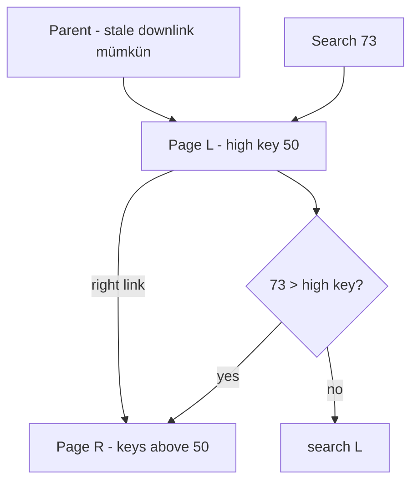

# Concurrent B+Tree: High Keys, Right Links & Safe Splits

## Konu anlatımı
Concurrent B+Tree'de temel problem, reader aşağı inerken writer'ın page split yapabilmesidir. Lehman–Yao ailesindeki tasarım her page'e right sibling link ve high key ekler. Reader stale parent downlink ile eski page'e inse bile aradığı key page high key'ini aşıyorsa sağa yürüyerek doğru key range'e ulaşır. Böylece split'in child değişikliği ile parent separator installation'ı tek dev atomik mutation olmak zorunda değildir.

PostgreSQL `nbtree` bu yaklaşım ailesini kullanır. Saf algoritmanın unshared in-memory page varsayımından farklı olarak PostgreSQL shared buffer pages kullanır; bu nedenle bir page okunurken record değişmesini önlemek için page-level read locking uygular.

## Mental model

## İçeride ne oluyor?
1. High key page'in key-space üst sınırıdır.
2. Split sırasında yeni right sibling oluşturulur ve side-link invariant korunur.
3. Reader eski child'a inse bile high-key check ile split'i fark eder.
4. Gerekirse birden çok right-link izlenebilir.
5. Parent separator daha sonra kurulabilir; traversal correctness side-link/high-key ile korunur.
6. Root split'te yeni root kurulmadan önce eski root'tan başlayan reader da side-link ile taşınmış key'e ulaşabilir.
7. Latch acquisition order deadlock açısından kritiktir; page latch transaction-level logical lock değildir.

## Mülakat soruları
- Concurrent split reader'a nasıl key kaçırtabilir?
- High key + right-link hangi invariant'ı sağlar?
- Parent separator gecikirse lookup neden hâlâ doğru olabilir?
- Page latch ile row/key transaction lock farkı nedir?
- Senior: stale root pointer ile root split correctness'ını açıkla.
- Staff: optimistic traversal ve latch coupling trade-off'u nedir?
- Principal: B+Tree concurrency, WAL ve buffer manager invariant'larını birlikte nasıl tasarlarsın?

## Beklenen cevap seviyesi
- **Mid:** page split, sibling link ve latch'i doğru tanımlar.
- **Senior:** high-key/right-link correctness'ını ve logical/physical locking ayrımını kurar.
- **Staff:** lock ordering, root split, scans ve contention trade-off'larını tartışır.
- **Principal:** protocolü WAL/recovery, buffer lifecycle ve fleet observability ile bağlar.

## Mini alıştırma
Stale parent'ın L page'ine yönlendirdiği bir ağaçta L split edilip araya S eklenmiş olsun. `key=73` ve `key=90` için high-key/right-link traversal'ını çiz. Hangi sırada publish yapılırsa reader key kaçırabilir, belirt.

## Proje fikri
Fixed-size pages, high-key ve right-link içeren küçük concurrent B+Tree yaz. Writer split sırasında parent update'i test hook ile geciktirsin; reader sonuçlarını reference ordered map ile karşılaştır. ThreadSanitizer ve deterministic schedule testleri ekle.

## Failure modes / trade-off
Yanlış high-key veya side-link publish order correctness bug'ı üretir. Coarse latch throughput'u sınırlar; aşırı optimistic traversal reclamation/correctness yükünü büyütür. Yanlış lock order deadlock yaratır.

## Production bağlantısı
Split rate, latch wait, page density, tree height, buffer hit, retry/deadlock ve index p99 birlikte izlenmelidir. Index concurrency yalnız data-structure konusu değil; WAL, buffer manager, vacuum/reclamation ve recovery ile ortak invariant'tır.

## Kaynaklar
- PostgreSQL source — nbtree README: https://github.com/postgres/postgres/blob/master/src/backend/access/nbtree/README
- PostgreSQL — B-Tree Indexes: https://www.postgresql.org/docs/current/btree.html
- Lehman & Yao — Efficient Locking for Concurrent Operations on B-Trees: https://doi.org/10.1145/319628.319663
