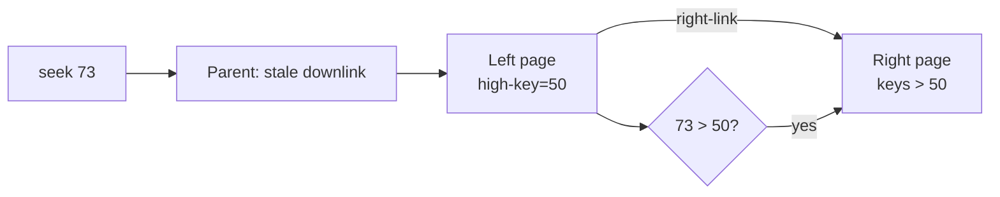

# Concurrent B+Tree Splits: High Keys, Right Links ve Latch Ordering

## Neden var?
Sequential B+Tree split kolay görünür: dolu page ikiye ayrılır ve parent'a separator eklenir. Concurrent reader/writer dünyasında parent kısa süre eski child pointer'ını gösterebilir. Correctness için bütün structural modification'ı global lock altında yapmak mümkün olsa da concurrency'yi öldürür. B-link yaklaşımı page'lere **high key** ve **right sibling link** ekleyerek stale navigation'dan recovery sağlar.

## Mental model

Parent split bilgisini henüz taşımıyor olsa bile reader child page'de range dışına düştüğünü görür ve sağa ilerler.

## Temel invariant'lar
- Non-rightmost page, o page'in izin verilen key-range üst sınırını temsil eden high key taşır.
- Right-link sağ sibling'e ulaşmayı sağlar.
- Search key high key'i aşıyorsa search sağa devam eder; birden çok concurrent split varsa bu tekrarlanabilir.
- Parent separator/downlink update'i child split ile aynı anda görünür olmak zorunda değildir; sibling chain geçiş dönemini güvenli kılar.
- Logical transaction lock ile kısa ömürlü physical page latch farklı problemlere hizmet eder.

PostgreSQL `nbtree` Lehman–Yao high-concurrency B-tree algoritmasını temel alır. Shared buffers nedeniyle PostgreSQL bir page'i incelerken page-level read locking uygular; klasik makaledeki saf lock-free reader varsayımını birebir kullanmaz. Buna rağmen high-key/right-link recovery modeli temel invariant'tır.

## Split adımları
1. Inserter target leaf'i bulur ve gerekli write latch'i alır.
2. Page doluysa yeni right sibling allocate edilir; key-space bölünür.
3. Sol page'in high key'i yeni sınırı temsil eder ve right-link yeni sibling'i gösterir.
4. Parent'a yeni pivot/downlink eklenir. Bu sırada reader eski parent state'ini görmüş olabilir.
5. Parent da doluysa split yukarı yayılır. Root split'te yeni root oluşturulur.
6. Reader stale downlink'e inse bile high key kontrolüyle sağa geçerek doğru range'i bulur.

## Latch ordering neden zor?
Birden fazla page latch'i aynı anda tutulduğunda acquisition order deadlock graph'ını belirler. 'Her zaman parent+child tut' correctness'i basitleştirebilir ama contention'ı artırır. Fazla optimistic protokol ise revalidation/restart karmaşıklığı getirir. PostgreSQL nbtree README'si bazı right/up geçişlerinde next page'i current bırakılmadan kilitlemenin güvenli olduğunu, left/down yönlerinde bunun deadlock riski yaratabileceğini özellikle ayırır.

## Mülakat soruları
1. Stale parent pointer concurrent B+Tree'de neden lookup kaybı olmak zorunda değildir?
2. High key ve right-link hangi invariant'ı kurar?
3. Transaction lock ile latch arasındaki fark nedir?
4. Reader neden birden fazla right-link izleyebilir?
5. Root split nasıl publish edilir?
6. Senior: latch coupling azaltılırsa hangi revalidation gerekir?
7. Staff: monoton artan primary key workload'unda hot rightmost leaf'i nasıl teşhis edersin?
8. Principal: B-link yaklaşımını optimistic/latch-free tree tasarımlarıyla nasıl kıyaslarsın?

## Beklenen cevap derinliği
- **Mid:** split, separator, sibling ve latch rollerini ayırır.
- **Senior:** stale-parent recovery ve deadlock-safe ordering'i anlatır.
- **Staff:** WAL, buffer manager, contention ve crash recovery bağlantısını kurar.
- **Principal:** proof obligations, reclamation, observability ve alternative index structures trade-off'unu tartışır.

## Mini alıştırma
`L=[10,20,30,40,50]` page'ine 60 insert edilirken 55 arayan reader parent'tan eski `L` downlink'ini alsın. Split sonrası left/right page, high key ve right-link'i çiz; reader'ın doğru page'e nasıl ulaştığını adım adım göster. Sonra parent update'inden önce ikinci bir split daha ekle.

## Proje fikri
`blink-tree-lab`: fixed-size in-memory page'ler, deterministic interleaving hooks ve invariant checker içeren küçük simulator. Split'i `right sibling publish`, `high-key/right-link publish`, `parent pivot publish` aşamalarına ayır; reader'ları her aşamada koştur.

## Failure modes / trade-off / production
Yanlış high key lookup kaybı; sibling link publish sırasındaki hata unreachable key-range; ters latch ordering deadlock üretir. Coarse locking throughput'u düşürür; aggressive optimism restart ve memory reclamation maliyetini büyütür. Production'da page split rate, tree height, fill ratio, rightmost-page contention, latch waits, buffer hit ratio, WAL bytes ve insert tail latency izlenmelidir.

## Kaynaklar
- PostgreSQL `nbtree` README: https://github.com/postgres/postgres/blob/master/src/backend/access/nbtree/README
- PostgreSQL `nbtree.h`: https://github.com/postgres/postgres/blob/master/src/include/access/nbtree.h
- Lehman & Yao, *Efficient Locking for Concurrent Operations on B-Trees*: https://doi.org/10.1145/319628.319663
