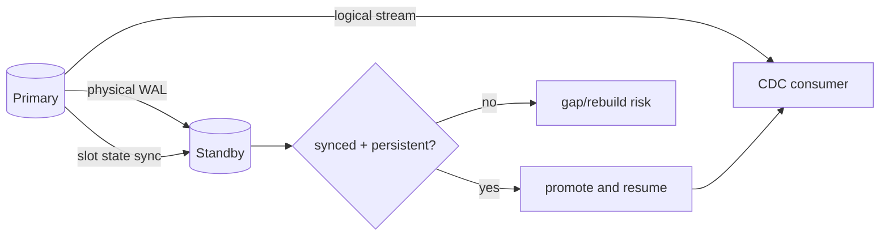

# PostgreSQL Logical Replication Failover Slots & CDC Continuity

## Konu anlatımı
Physical standby promotion database write availability'yi geri getirebilir, fakat logical CDC continuity ayrıca replication slot state gerektirir. Slot consumer progress ve gerekli WAL/catalog horizon'unu temsil eder. PostgreSQL 18 failover-enabled logical slots'ın physical standby'a senkronize edilmesini destekler.

Subscription/slot `failover=true` olabilir; standby'da `sync_replication_slots=true` slot-sync worker'ını etkinleştirir. Primary'deki `synchronized_standby_slots`, logical sender'ın consumer'ı standby'ın durable olarak alamadığı WAL'ın önüne geçirmemesine yardımcı olur. Continuity karşılığında delivery latency ve standby health coupling'i artabilir.

## Mental model

## İçeride ne oluyor?
- Logical slot connection'dan bağımsız progress ve retention state tutar.
- Failover slot primary'de `failover=true` olarak işaretlenir.
- Standby slot state'i periyodik senkronize eder.
- Physical slot ve `hot_standby_feedback` WAL/catalog continuity açısından önemlidir.
- Promotion öncesi `pg_replication_slots` üzerinde `synced`, persistence ve invalidation kontrol edilmelidir.
- Logical decoding crash/failover çevresinde duplicate delivery üretebileceğinden downstream idempotency gerekir.

## Mülakat soruları
1. Physical failover neden logical CDC continuity'yi otomatik garanti etmez?
2. Replication slot neyi saklar ve disk açısından hangi riski yaratır?
3. `sync_replication_slots` ile `synchronized_standby_slots` farkı nedir?
4. Senior: consumer standby'dan ilerideyse hangi correctness sorunu çıkar?
5. Principal: CDC RPO=0 için latency ve availability trade-off'u nedir?

## Seviye beklentisi
- **Mid:** WAL, LSN, logical slot ve consumer progress'i açıklar.
- **Senior:** slot sync prerequisites, retention ve promotion readiness'i teşhis eder.
- **Staff:** backpressure, disk exhaustion ve failover runbook tasarlar.
- **Principal:** RPO/RTO, regional topology ve downstream idempotency'yi birlikte değerlendirir.

## Alıştırma / proje
Consumer LSN=500, standby durable WAL=470 ve slot sync=465 iken primary kaybını analiz et. `pg-logical-failover-lab` ile primary, physical standby ve logical subscriber kur; workload sırasında promotion yapıp duplicate/gap davranışını LSN üzerinden gözle.

## Failure modes / production
Stale/invalidated slot, WAL retention nedeniyle disk dolması, standby lag, consumer'ın standby'dan öne geçmesi ve readiness kontrolünün atlanması başlıca risklerdir. `confirmed_flush_lsn`, `restart_lsn`, standby lag, `synced`, `invalidation_reason`, retained WAL bytes, consumer lag ve failover resume time izlenmelidir.

## Kaynaklar
- PostgreSQL 18 — Logical Replication Failover: https://www.postgresql.org/docs/18/logical-replication-failover.html
- PostgreSQL 18 — Logical Decoding / Slot Synchronization: https://www.postgresql.org/docs/18/logicaldecoding-explanation.html
- PostgreSQL 18 — Replication Configuration: https://www.postgresql.org/docs/18/runtime-config-replication.html
