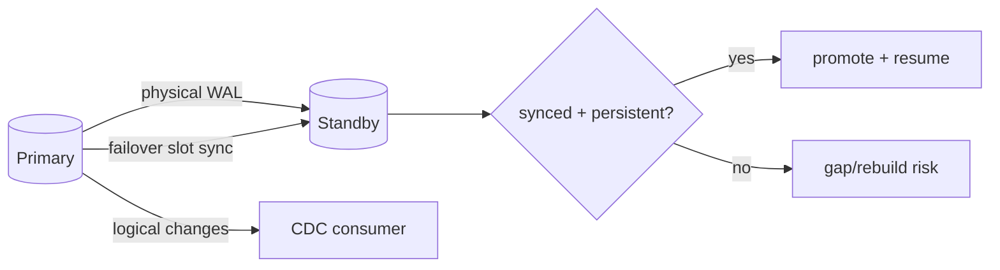

# PostgreSQL Logical Replication Failover Slots & CDC Continuity

**Seviye:** Mid → Principal  
**Alan:** Databases / Distributed Systems

## Mental model

## Temel fikir
Physical promotion database write availability'yi geri getirir ama logical CDC continuity için slot state de yeni primary'de hazır olmalıdır. PostgreSQL 18'de `failover=true` logical slot/subscription'lar standby'a synchronize edilebilir. Standby `sync_replication_slots=true` ile slot-sync worker çalıştırır; primary'deki `synchronized_standby_slots` logical sender'ın standby'ın durable WAL progress'inin önüne geçmesini engelleyebilir.

Failover readiness yalnız slot adının standby'da bulunması değildir. Gerekli slot persistent ve `synced=true` olmalı, invalidated olmamalı ve required WAL/catalog rows standby'da bulunmalıdır.

## Interview invariants
- Logical slot connection'dan bağımsız progress/resource-retention state'idir.
- Physical HA logical consumer progress'ini otomatik taşımaz.
- `sync_replication_slots`: standby'ın failover slot state'ini almasıdır.
- `synchronized_standby_slots`: logical sender progress'ini physical standby WAL receipt'i ile sınırlar.
- Crash/failover sonrası duplicate delivery mümkün olduğundan sink idempotency hâlâ önemlidir.

## Failure modes ve trade-off
Standby lag, invalidated slot, missing `hot_standby_feedback`, WAL retention/disk exhaustion ve consumer'ın standby'dan öne geçmesi continuity'yi bozabilir. Daha güçlü synchronization RPO'yu iyileştirirken logical delivery latency ve standby availability coupling'ini artırabilir.

## Production gözlemleri
`restart_lsn`, `confirmed_flush_lsn`, retained WAL bytes, standby flush/replay lag, `synced`, `invalidation_reason`, consumer lag, duplicate-event rate ve failover resume time izlenmelidir.

## Kaynaklar
- PostgreSQL 18 — Logical Replication Failover: https://www.postgresql.org/docs/18/logical-replication-failover.html
- PostgreSQL 18 — Logical Decoding Concepts / Slot Synchronization: https://www.postgresql.org/docs/18/logicaldecoding-explanation.html
- PostgreSQL 18 — Replication Configuration: https://www.postgresql.org/docs/18/runtime-config-replication.html
