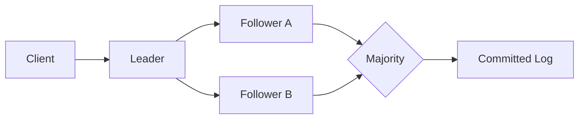

# Raft Consensus — Leader Election, Log Replication ve Safety

Raft, replicated state machine'lerde node'ların tek bir sıralı log üzerinde anlaşmasını sağlayan consensus algoritmasıdır. Tasarımı consensus problemini leader election, log replication ve safety parçalarına ayırarak anlaşılabilirliği artırmayı hedefler.

## Mental model

Leader öneriyi log'una ekler, follower'lara çoğaltır ve gerekli çoğunluk sağlandığında commit ilerler. `term` mantıksal liderlik dönemidir. Eski bir leader partition sonrası geri döndüğünde daha yüksek term görürse step-down eder. Kritik fikir bütün node'ların her an aynı olması değil, commit edilmiş log tarihinin güvenli biçimde korunmasıdır.

## Mülakat derinliği

Senior: election, heartbeat, log replication ve majority kavramlarını doğru açıkla. Staff: stale leader, quorum intersection, disk durability, snapshotting ve membership değişimini tartış. Principal: consensus'un latency/availability/operasyon maliyetini ve hangi metadata problemlerinde kullanılmasının mantıklı olduğunu açıkla.

## Failure modes ve trade-off

Election storm, slow disk/fsync, asymmetric partition, slow follower ve log büyümesi temel risklerdir. Partition sırasında safety korunurken yazma availability'si azalabilir. Consensus'u data plane'deki her objeye uygulamak pahalı olabilir; control-plane metadata'sı daha doğal kullanım alanıdır.

## Habitat bağlantısı

Habitat benzeri storage abstraction platformunda backend registration, shard ownership, lease veya configuration metadata'sı consensus ile tutulabilir. Büyük blob/data path'i ise kendi storage sisteminin replication semantiğine bırakılabilir. Böylece güçlü koordinasyon yalnız gerçekten gerekli control-plane kararlarında kullanılır.

## Mini lab

5 node'lu bir cluster simüle et. Leader'ın hangi follower kombinasyonlarında commit ilerletebildiğini test et. Ardından leader partition ve recovery senaryosu ekleyerek eski leader'ın neden yeniden yazma kabul edememesi gerektiğini göster.

## Kaynaklar

- Raft ana sitesi ve yayınlar: https://raft.github.io/
- Diego Ongaro ve John Ousterhout, Raft sunumu: https://raft.github.io/slides/coreosfest2015.pdf
