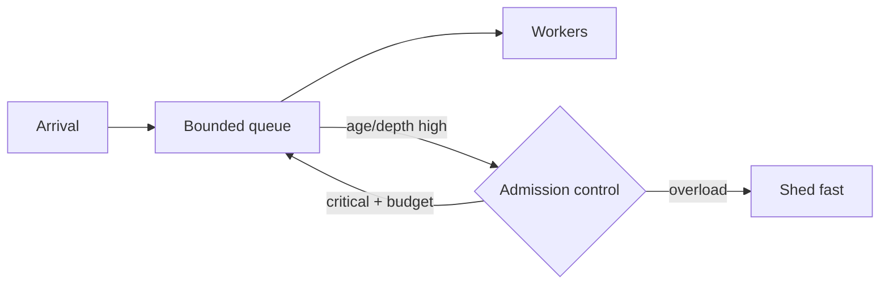

# Backpressure, Bounded Queues ve Load Shedding

## Temel fikir
Arrival rate uzun süre service rate'i aşarsa queue büyür ve latency patlar. Queue kısa burst'leri absorbe eder; kalıcı kapasite açığını çözmez.

- **Backpressure:** upstream üretim hızını düşürmek için feedback.
- **Bounded queue:** sistemde bekleyebilecek işi sınırlar.
- **Load shedding:** kapasite yokken bazı işleri erken reddeder.
- **Admission control:** hangi işin sisteme gireceğini policy ile seçer.

## Neden bounded?
Unbounded queue memory ve residence time'ı sınırsız büyütebilir; client çoktan timeout olmuş olsa bile stale work tüketmeye devam edebilir. Bounded concurrency ve deadline-aware admission sistemi hızlı ve kontrollü failure'a zorlar.

Queue depth tek başına yeterli değildir: farklı service time'larda aynı depth farklı risk taşır. Queue age ve deadline slack doğrudan kullanıcı latency riskine daha yakın sinyallerdir.

## Retry etkileşimi
Shedding yapan servis client'lar tarafından agresif retry edilirse overload feedback loop büyür. Retry budget, exponential backoff/jitter ve explicit overload sinyalleri birlikte düşünülmelidir.

## Mülakat soruları
1. Backpressure ve load shedding farkı nedir?
2. Unbounded queue neden reliability riski?
3. Queue age neden depth'ten daha anlamlı olabilir?
4. Priority admission starvation'ı nasıl önler?
5. Retry storm ile shedding nasıl koordine edilir?

## Habitat bağlantısı
Multi-tenant storage gateway'de tenant başına concurrency/admission budget noisy-neighbor etkisini sınırlar. Control-plane operasyonları data-plane bulk transfer'dan ayrı priority sınıfında tutulabilir; fakat starvation guard gerekir.

## Kaynaklar
- https://sre.google/sre-book/handling-overload/
- https://sre.google/sre-book/addressing-cascading-failures/
