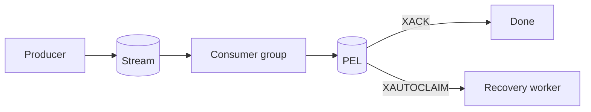

# Redis Streams Consumer Groups, PEL & Recovery

## Mental model
Producer `XADD` ile append-only stream'e yazar. Consumer group, teslim edilmiş fakat `XACK` edilmemiş entry'leri Pending Entries List (PEL) içinde izler. Worker ölürse `XPENDING` ile stale işler görülür ve `XAUTOCLAIM` ile ownership başka consumer'a taşınabilir.

## Interview depth
Junior/Mid: stream, group, ACK. Senior: PEL, claim, idempotency, lag. Staff: poison messages, retry policy, backpressure ve recovery observability.

## Production trade-offs
ACK-before-side-effect veri kaybı; ACK-after-side-effect duplicate riskidir. At-least-once processing idempotent side effect ister. Pending age, group lag, delivery count ve retry exhaustion production sinyalleridir.

## Mini alıştırma / proje
Crash injection yapan iki worker kur; `XPENDING` ve `XAUTOCLAIM` recovery loop'u ekle. Duplicate processing ve pending age ölç.

## Kaynaklar
- https://redis.io/docs/latest/develop/data-types/streams/
- https://redis.io/docs/latest/commands/xautoclaim/
- https://redis.io/docs/latest/commands/xack/
