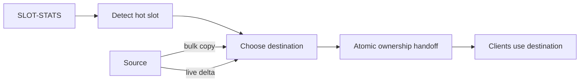

# Redis Atomic Slot Migration, Hot Slots & Rebalancing

Redis Cluster keyspace'i hash slot'lara böler. Redis 8.4'te `CLUSTER MIGRATION`, bulk copy + live delta + atomic ownership handoff modeliyle slot taşıma sırasında ara ownership durumlarını azaltır. Redis 8.2 `CLUSTER SLOT-STATS` ise key count yanında CPU ve network I/O gibi workload sinyalleri verir.

## Temel invariant'lar
Kopyalama sürerken source authoritative kalır; destination bulk state ile live delta'yı yakalar; ownership ancak destination hazır olduğunda atomik değişir. Rebalancer destination headroom, migration bandwidth ve failure recovery'yi hesaba katmalıdır.

## Hot slot ≠ hot key
Bir slot toplam workload nedeniyle sıcak olabilir; tek bir hot key ise slotu başka node'a taşısanız bile aynı tek-key yoğunluğunu taşır. Çözüm workload modeline göre replication/cache/application sharding gibi farklı teknikler gerektirebilir.

## Mülakat derinliği
Junior sharding/hash slot; Mid load skew ve migration; Senior copy/delta/handoff failure invariants; Staff hysteresis, cooldown, capacity ve safe automation; Principal/CTO availability riski ile operational simplicity/platform economics tartışmalıdır.

## Failure modes / production
Key count'u load sanmak, destination headroom kontrol etmemek, eşzamanlı migration ile network'ü doyurmak ve oscillation yaratmak tipik hatalardır. Per-slot CPU/network, node memory, migration throughput/duration, p95/p99 latency ve error/redirect sinyalleri izlenmelidir.

## Alıştırma ve proje
Üç node ve altı slotluk CPU-skew senaryosunda migration planı çıkar. Dry-run rebalancer geliştirerek SLOT-STATS'tan aday üret; öncesi/sonrası latency ve skew raporla.

## Kaynaklar
- https://redis.io/docs/latest/develop/whats-new/8-4/
- https://redis.io/blog/atomic-slot-migration/
- https://redis.io/docs/latest/develop/whats-new/8-2/
