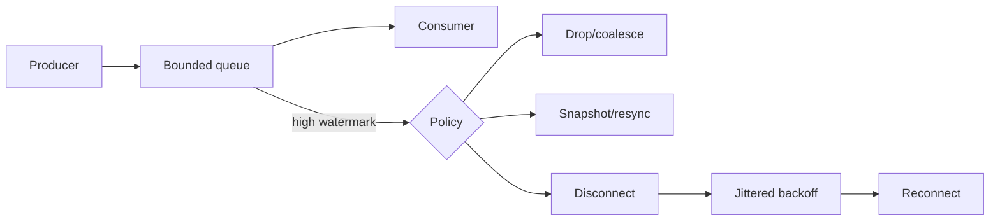

# WebSocket Backpressure, Slow Consumers & Reconnect Storms

## Konu anlatımı
WebSocket çift yönlü ve uzun ömürlüdür; fakat producer ve consumer hızları eşit olmak zorunda değildir. Browser'ın klasik `WebSocket` API'sinde receive backpressure mekanizması yoktur. Consumer geride kalırsa buffering memory/CPU baskısına dönüşebilir. Bu yüzden production invariant'ı **bounded queue + explicit overload policy** olmalıdır.

Server'da per-connection byte/message limiti, high-watermark, coalescing/drop, snapshot-resync veya slow-client disconnect uygulanabilir. Disconnect sonrası tüm client'ların aynı anda dönmesi reconnect storm yaratır; RFC 6455 abnormal closure sonrasında randomized delay ve artan backoff önerir.

## Mülakat soruları
1. Backpressure nedir; TCP flow control neden application queue'sunu tek başına çözmez?
2. Slow consumer nasıl ölçülür?
3. Drop/coalesce hangi ürünlerde correctness açısından kabul edilebilir?
4. Sequence number ve snapshot/resync ne sağlar?
5. 1M connection için per-client memory budget nasıl hesaplanır?
6. Reconnect storm nasıl sınırlandırılır?

## Seviyeye göre cevap derinliği
- **Mid:** bounded queue, producer/consumer rate, backoff.
- **Senior:** high-watermark, gap detection, idempotent resync, fairness.
- **Staff:** fleet admission, fan-out topology, overload containment, tenant isolation.
- **Principal/CTO:** realtime UX, infrastructure cost ve degradation policy.

## Mini alıştırma
10k msg/s producer, 1k msg/s consumer ve 500-byte mesaj için 60 saniyelik backlog'u hesapla. 8 MB queue limiti için iki overload policy öner.

## Proje fikri
WebSocket fan-out load lab: ayarlanabilir consumer rate, bounded queues, high-watermark telemetry, coalescing ve jittered reconnect.

## Failure modes / trade-off / production
Unbounded queue, jitter'sız reconnect, sequence gap'i sessizce yutmak ve yalnız connection count izlemek temel failure mode'lardır. Queue bytes, oldest-message age, send latency, disconnect reason, reconnect/gap/resync rate izle. Drop fidelity kaybettirir; disconnect kaynak korur fakat reconnect load yaratır; snapshot-resync protocol complexity ekler.

## Kaynaklar
- MDN WebSocket API: https://developer.mozilla.org/en-US/docs/Web/API/WebSockets_API
- RFC 6455: https://www.rfc-editor.org/rfc/rfc6455
- WHATWG WebSockets: https://websockets.spec.whatwg.org/
