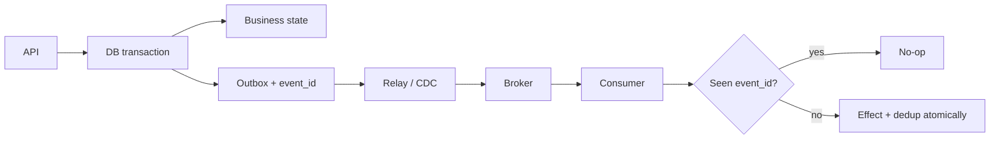

# Transactional Outbox, Idempotent Consumers & Exactly-Once Illusions

Bir servis hem local veritabanını güncelleyip hem broker'a event gönderdiğinde dual-write atomicity problemi oluşur. Transactional outbox, business state ile event intent'ini aynı DB transaction içinde commit eder; relay/CDC committed kayıtları broker'a taşır.

## Temel invariant

**Atomic local intent + at-least-once transport + idempotent effect.** Outbox end-to-end exactly-once sağlamaz. Relay publish ettikten sonra checkpoint öncesi crash ederse duplicate event oluşabilir. Consumer dedup state'i ile business effect aynı atomic boundary içinde tutulmalıdır.

## Ordering

Global ordering çoğu sistemde gereksiz ve pahalıdır. Genellikle aggregate/entity key başına ordering yeterlidir. Partition key, event sequence/version ve consumer concurrency birlikte tasarlanmalıdır.

## Relay seçenekleri

Polling publisher basit ve taşınabilirdir fakat DB polling yükü ve ek latency yaratabilir. Log-based CDC düşük latency ve yüksek throughput sağlayabilir; connector, replication slot/log retention ve operasyonel failure mode'ları ekler.

## Mülakat soruları

1. Dual write neden atomik değildir?
2. Outbox hangi failure window'u kapatır?
3. Relay neden duplicate publish edebilir?
4. Idempotency key nasıl seçilir ve ne kadar tutulur?
5. Per-aggregate ordering nasıl korunur?
6. Polling ile CDC trade-off'u nedir?
7. Replay ve schema evolution nasıl yönetilir?
8. CTO: ortak outbox platformu ne zaman build edilir?

## Failure injection alıştırması

DB commit öncesi, commit sonrası/publish öncesi, publish sonrası/checkpoint öncesi ve consumer effect sonrası/ack öncesi crash noktalarını test et. Her durumda business state, event sayısı ve recovery davranışını kaydet.

## Failure modes / production

Outbox'ı exactly-once sanmak, dedup state'i effect'ten ayrı transaction'da tutmak, sınırsız retention, global ordering istemek, schema version taşımamak ve relay lag alarmı kurmamak yaygın hatalardır. Outbox backlog/oldest age, relay throughput/errors, duplicate rate, consumer lag, poison events ve replay volume izlenmelidir.

## Kaynaklar

- AWS Prescriptive Guidance — Transactional outbox: https://docs.aws.amazon.com/prescriptive-guidance/latest/cloud-design-patterns/transactional-outbox.html
- Apache Kafka — Delivery semantics: https://kafka.apache.org/documentation/#semantics
- PostgreSQL — Transactions: https://www.postgresql.org/docs/current/tutorial-transactions.html