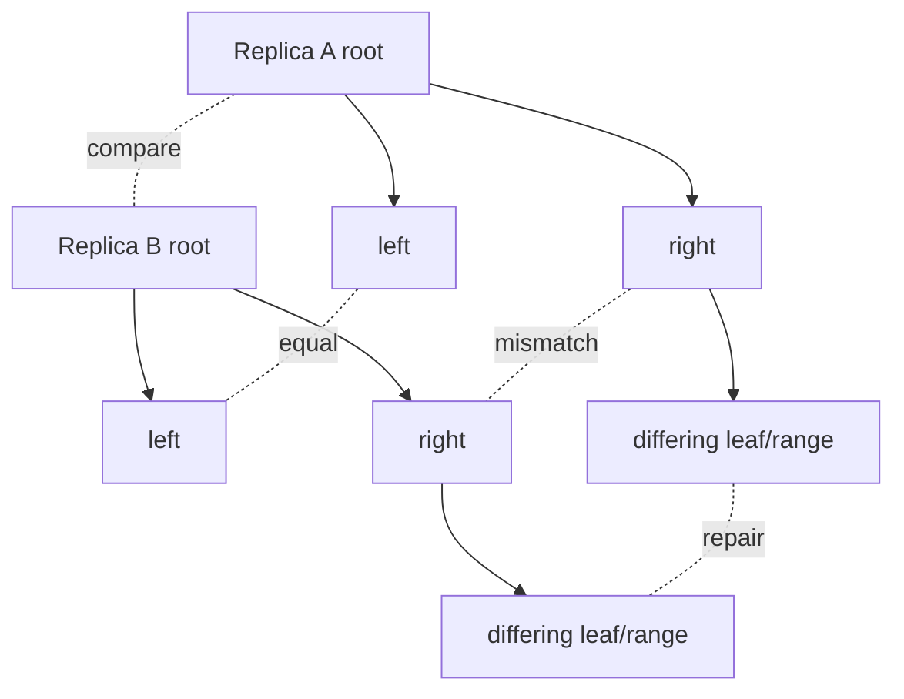

# Merkle Trees, Anti-Entropy Repair & Replica Convergence

## Mental model
Eventual consistency bir sonuç değil, convergence mekanizmaları gerektiren bir sistem özelliğidir. Merkle tree replica dataset'ini hiyerarşik hash özetine çevirir: root eşitse range için stop; root farklıysa yalnız farklı subtree'lere in ve gereken range'i stream et.

## Neden Merkle tree?
Tek bir dataset hash'i yalnız “fark var” der. Merkle tree farkın nerede olduğunu logaritmik tree traversal ile daraltabilir ve tüm dataset'i network üzerinden karşılaştırma ihtiyacını azaltır. Amazon Dynamo her node'un host ettiği key range için tree tutar; ortak range root'ları karşılaştırılır ve farklı subtree'ler senkronize edilir.

## Hints, read repair ve anti-entropy
Hints geçici unavailable replica'ya missed mutation ulaştırmayı dener; best-effort'tur. Read repair read path üzerinde görülen farkları düzeltebilir. Anti-entropy repair ortak token range'leri sistematik biçimde karşılaştırarak convergence için daha güçlü mekanizma sağlar.

## Resolution trade-off
Daha büyük tree / daha küçük leaf range:
- daha fazla memory ve hash metadata,
- daha hassas mismatch localization,
- daha az over-streaming.

Daha küçük tree / daha büyük leaf range:
- daha az memory,
- daha kaba localization,
- küçük mismatch için daha fazla data streaming.

Cassandra'nın `repair_session_space` ayarı bu trade-off'u doğrudan etkiler. Repair ayrıca disk scan, CPU, network ve sonrasında compaction baskısı yaratabilir.

## Incremental vs full repair
Incremental repair yeni/unrepaired data'yı daha düşük rutin maliyetle senkronize eder. Full repair daha geniş doğrulama sağlar ve corruption/operator error gibi incremental history'nin kaçırabileceği senaryolarda gerekir. Repair cadence tombstone/gc grace ile birlikte düşünülmelidir; çok uzun unrepaired interval silinmiş verinin yeniden görünmesi gibi riskler yaratabilir.

## Mülakat soruları
1. Merkle tree neden tek root hash'ten daha faydalıdır?
2. Hash collision correctness modelini nasıl etkiler?
3. Concurrent writes sırasında tree snapshot semantiğini nasıl tasarlarsın?
4. Tree resolution ile repair bandwidth arasında nasıl seçim yaparsın?
5. Hints neden anti-entropy'nin yerine geçmez?
6. Multi-DC repair blast radius'u nasıl sınırlanır?

## Seviye beklentisi
- **Mid:** hierarchical hash ve mismatch localization.
- **Senior:** hints/read repair/anti-entropy, tombstone ve I/O trade-off.
- **Staff:** range sizing, concurrency, incremental/full repair ve capacity reserve.
- **Principal:** convergence SLO, repair governance ve fleet-wide failure containment.

## Production checklist
Repair age, mismatched ranges, validation duration, bytes streamed, disk/network saturation, compaction backlog ve unrepaired-data age ölç. Repair job'larını bounded concurrency ve retry/backoff ile orkestre et; validation/preview mekanizmasını rollout öncesi kullan.

## Kaynaklar
- Amazon Science — Dynamo: https://www.amazon.science/publications/dynamo-amazons-highly-available-key-value-store
- Apache Cassandra 5.0 — Dynamo architecture: https://cassandra.apache.org/doc/stable/cassandra/architecture/dynamo
- Apache Cassandra 5.0 — Repair: https://cassandra.apache.org/doc/latest/cassandra/managing/operating/repair.html
- Apache Cassandra — configuration / repair_session_space: https://cassandra.apache.org/doc/latest/cassandra/managing/configuration/cass_yaml_file.html
