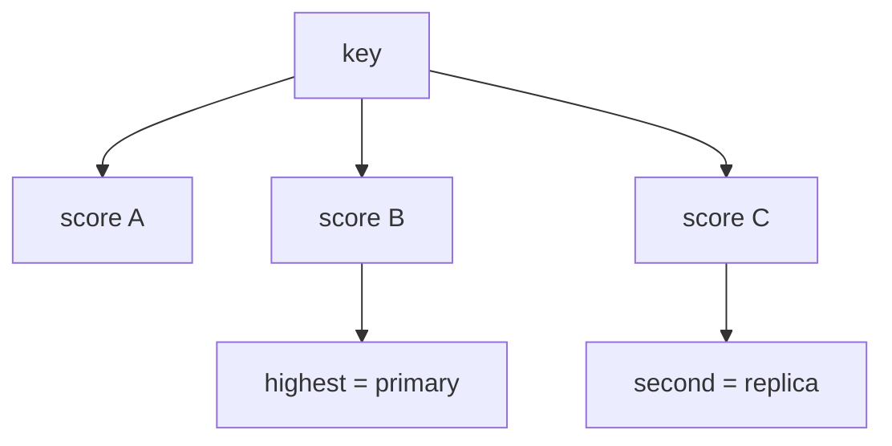

# Rendezvous (HRW) Hashing, Minimal Churn & Replica Placement

## Temel fikir
Rendezvous hashing / Highest Random Weight (HRW), aynı membership listesini gören katılımcıların merkezi koordinasyon olmadan bir key için aynı node sıralamasını üretmesini sağlar.

`owner(key) = argmax_node H(key, node)`

Her `(key,node)` çifti deterministik score alır. En yüksek score primary olur; score sırasındaki sonraki node'lar replica set'i oluşturabilir.

## Mental model

## Minimal churn
Bir node çıkarıldığında surviving node'ların kendi aralarındaki score sırası değişmez. Bu yüzden yalnız çıkarılan node'un winner/replica olduğu key'lerin placement'ı değişir. Yeni node eklenince yalnız yeni node'un mevcut winner'dan daha yüksek score aldığı key'ler taşınır.

Bu özellik membership consistency sağlamaz. İki client farklı membership version görüyorsa aynı key için farklı owner seçebilir. Control plane'in membership propagation/versioning modeli ayrı bir correctness problemidir.

## Ring ile trade-off
Basit HRW ring/vnode metadata'sı gerektirmez ve top-k replica seçimini doğal verir. Buna karşılık basit lookup N node'un tamamını score ettiği için O(N)'dir. Ring tabanlı consistent hashing daha düşük lookup maliyetine optimize edilebilir ancak balance için virtual-node/state karmaşıklığı ekleyebilir.

Heterojen capacity için weighted HRW kullanılabilir; ağırlığı score'a naifçe çarpmak doğru dağılım garantisi değildir. Failure-domain constraint (zone/rack) de hash sıralamasından ayrı placement politikası olarak ele alınmalıdır.

## Mülakat çekirdeği
- HRW nasıl çalışır ve neden deterministiktir?
- Node removal neden minimal churn üretir?
- Top-k replica nasıl seçilir?
- Ring-based consistent hashing ile farkı nedir?
- Membership skew hangi correctness sorununu doğurur?
- Weighted ve zone-aware placement nasıl tasarlanır?

## Failure modes
- Runtime/process-randomized hash kullanmak.
- Stable olmayan node identity.
- Membership version skew.
- Naif weighted-score formülü.
- Aynı failure domain'den tüm replica'ları seçmek.
- Hot-key sorununu placement balance ile karıştırmak.

## Production telemetry
Membership version skew, owner disagreement, remap ratio, max/avg load, lookup CPU, node saturation ve replica zone/rack diversity izlenmelidir.

## Kaynaklar
- Thaler & Ravishankar — A Name-Based Mapping Scheme for Rendezvous (1996): https://www.eecs.umich.edu/techreports/cse/96/CSE-TR-316-96.pdf
- UC eScholarship mirror: https://escholarship.org/uc/item/3ks7q6mx
- Local Rendezvous Hashing (2025): https://arxiv.org/abs/2512.23434
