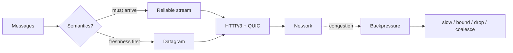

# WebTransport Streams, Datagrams & Application Backpressure

**Seviye:** Junior → Principal  
**Alan:** Networking / System Design

## Konu anlatımı
WebTransport browser-server iletişiminde aynı secure HTTP/3/QUIC session içinde reliable stream ve unreliable datagram semantiği sunar. Stream must-arrive/ordered byte delivery içindir; datagram freshness'in delivery garantisinden değerli olduğu transient state için uygundur. Tasarımın özü protokol adı değil, message value ile delivery semantics'i eşlemektir.

Network producer'dan yavaşsa application'ın sonsuz queue büyütmesi çözüm değildir. Reliable veri producer slowdown/bounded queue gerektirebilir; transient datagram state'i drop veya coalesce edilebilir. Transport security application authorization'ın yerine geçmez.

## Mental model

**Invariant:** delivery semantics message değerinden türetilir; congestion durumunda bounded policy gerekir.

## İçeride ne oluyor?
- Session HTTP/3/QUIC üzerinde kurulur.
- Bidirectional/unidirectional stream'ler bağımsız reliable byte akışlarıdır.
- Datagram unreliable ve unordered mesaj semantiğine uygundur.
- QUIC stream multiplexing cross-stream head-of-line etkisini azaltır; aynı stream'deki ordering devam eder.
- Congestion/flow control transport'ta olsa da application queue budget'ı ayrıca tasarlanır.
- Reconnect/resume application-level state ve idempotency gerektirebilir.

## Mülakat soruları
1. WebTransport ile WebSocket arasında hangi semantic farkları düşünürsün?
2. Stream ve datagram arasında nasıl seçim yaparsın?
3. QUIC multiplexing head-of-line blocking'i tamamen yok eder mi?
4. Backpressure neden application problemidir?
5. Datagram loss neden her zaman retry edilmemelidir?
6. Senior: multiplayer oyunda input, snapshot ve chat'i nasıl sınıflandırırsın?
7. Staff: reconnect, auth expiry, path change ve overload policy nasıl tasarlanır?
8. Principal: browser/gateway desteği, telemetry ve fallback ekonomisini nasıl değerlendirirsin?

## Beklenen cevap seviyesi
- **Junior:** reliable/unreliable ve ordered/unordered ayrımını bilir.
- **Mid:** stream/datagram mapping ve bounded queue tasarlar.
- **Senior:** congestion, flow control, reconnect ve idempotency trade-off'larını açıklar.
- **Staff/Principal:** edge compatibility, abuse control, observability, fallback ve rollout ekonomisini yönetir.

## Mini alıştırma
Collaborative whiteboard için cursor, stroke, checkpoint ve chat mesajlarını stream/datagram olarak sınıflandır. 500 ms stall sırasında drop/coalesce/block politikasını yaz.

## Proje fikri
`webtransport-realtime-lab`: cursor datagram + reliable chat/document stream; loss/latency injection altında message age, queue depth, drop ve reconnect ölç; WebSocket fallback ekle.

## Failure modes / trade-off / production bağlantısı
Her şeyi tek reliable stream'e koymak, datagram'ı yalnız 'hızlı' diye seçmek, unbounded queue, stale state retry, reconnect duplicate side-effect, proxy/LB compatibility eksikliği ve transport encryption'ı authorization sanmak tipik hatalardır. Queue bytes, message age, RTT/loss, drop, reset, reconnect, auth failure ve fallback oranı izlenir.

## Kaynaklar
- W3C WebTransport: https://www.w3.org/TR/webtransport/
- W3C Candidate Recommendation announcement — 30 Temmuz 2026: https://www.w3.org/news/2026/w3c-invites-implementations-of-webtransport/
- IETF RFC 9297 — HTTP Datagrams: https://www.rfc-editor.org/rfc/rfc9297
- IETF RFC 9000 — QUIC: https://www.rfc-editor.org/rfc/rfc9000
