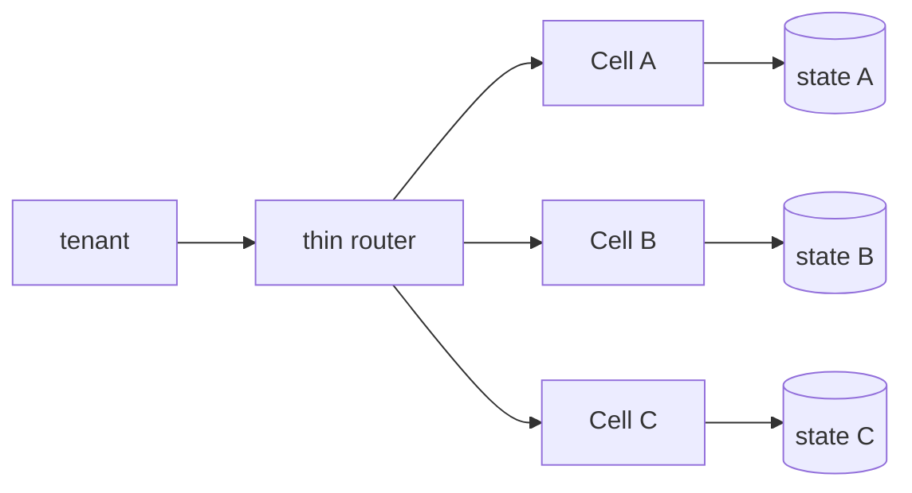

# Cell-Based Architecture, Fault Isolation & Blast-Radius Economics

Cell-based architecture, sistemi bağımsız ve bounded-capacity replica'lara böler. Amaç yalnız scale değil, software bug, overload, bad deployment ve dependency failure için scope of impact'i sınırlamaktır.

## Temel invariant'lar
- Tenant→cell mapping stabil ve gözlemlenebilir olmalı.
- Router yeni global SPOF olmamalı; cached/static mapping tercih edilebilir.
- Compute kadar state ve critical dependencies de failure boundary'yi izlemeli.
- Cell capacity bounded olmalı; failover healthy cell'leri zincirleme düşürmemeli.
- Rebalancing state migration + cutover + rollback problemidir.

## Cell vs shard
Shard öncelikle data partitioning kavramıdır. Cell ise request-serving stack'in daha geniş bir bölümünü fault-isolation boundary olarak tekrarlar. Bir cell bir veya daha fazla shard içerebilir; cell'ler aynı shared database'e bağlıysa isolation önemli ölçüde zayıflar.

## Blast-radius economics
Daha küçük cell, failure başına daha az müşteri etkisi demektir; fakat fixed overhead, capacity fragmentation, deployment orchestration ve operational complexity artar. Cell size SLO + revenue-at-risk + tenant tier + headroom maliyetiyle seçilmelidir.

## Mülakat soruları
1. Cell ile shard arasındaki fark nedir?
2. Router neden thin data-plane component olmalıdır?
3. Shared DB cell isolation'ı nasıl deler?
4. Stateful tenant migration nasıl yapılır?
5. Random spillover neden cascading failure yaratabilir?
6. Staff: N+1 capacity/headroom nasıl hesaplanır?
7. Principal: control plane ve data plane nasıl ayrılır?
8. CTO: blast-radius hedefi ekonomik olarak nasıl seçilir?

## Production checklist
Per-cell latency/error/saturation, affected tenant count, routing-cache hit, assignment skew, headroom, migration duration ve shared-dependency health izlenir. Game day'de cell loss, router loss, bad deploy ve overloaded-cell senaryoları ayrı ayrı test edilir.

## Kaynaklar
- AWS — Guidance for Cell-Based Architecture: https://docs.aws.amazon.com/solutions/cell-based-architecture-on-aws/
- AWS Prescriptive Guidance — Serverless Cell Router: https://docs.aws.amazon.com/prescriptive-guidance/latest/patterns/serverless-cell-router-architecture.html
