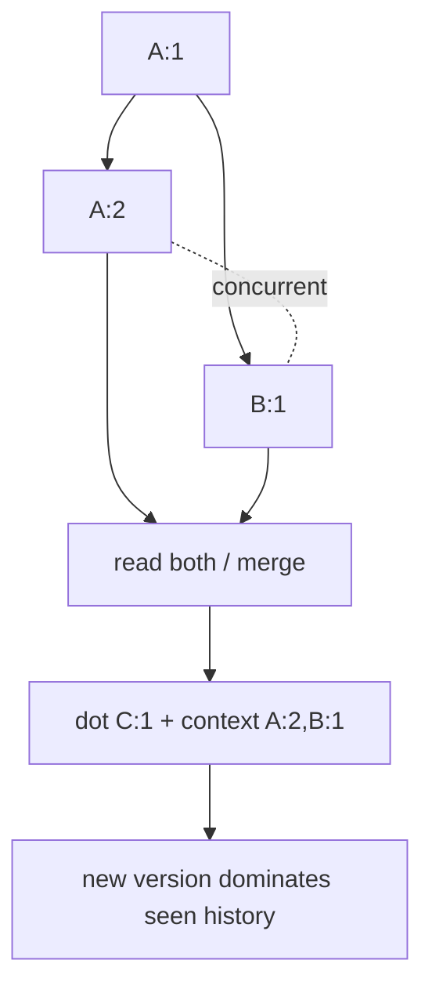

# Dotted Version Vectors, Causal Context & Conflict Economics

**Seviye:** Mid → Principal | **Alan:** Distributed Systems / System Design

## Konu anlatımı
Eventually consistent multi-replica sistemde physical timestamp causality değildir. Bir write önceki write'ı görerek üretildiyse `happens-before`; birbirlerini görmeden oluşmuş iki write concurrent'dır. Vector clock actor→counter map'iyle bu partial order'ı temsil eder. Dotted Version Vector (DVV) yeni event'i tek bir `(actor,counter)` dot olarak, daha önce görülmüş event'leri causal context olarak ayırır. Bu ayrım gereksiz sibling üretimini azaltabilir.

Causal metadata gerçek concurrent conflict'i çözmez. Domain hâlâ CRDT/merge, sibling exposure veya LWW gibi policy seçer. LWW operasyonel olarak basittir ancak clock skew ve concurrent intent kaybı nedeniyle veri kaybettirebilir.

## Mental model

**Invariant:** causal order wall-clock order değildir; concurrent değerler zorla eski/yeni diye sıralanmak zorunda değildir.

## İçeride ne oluyor?
- `V1 <= V2`, V2'nin V1 causal history'sini içerdiğini ifade eder.
- İki vector birbirini dominate etmiyorsa event'ler concurrent'dır.
- Dot yeni event kimliği; context gözlenen geçmişin compact özetidir.
- Read/modify/write sırasında causal context write'a geri taşınmalıdır.
- Read repair ve anti-entropy obsolete version'ları causal relation ile ayıklayabilir.
- Actor identity cardinality'si metadata maliyetini belirler.

## Mülakat soruları
1. Physical timestamp causality için neden yetersizdir?
2. Vector clock concurrency'yi nasıl gösterir?
3. Dominance ne demektir?
4. Dot ve causal context neden ayrıdır?
5. Context kaybolursa ne olur?
6. Senior: sibling explosion nasıl teşhis edilir?
7. Staff: DVV, LWW ve CRDT arasında nasıl seçim yapılır?
8. Principal: actor cardinality ve metadata budget nasıl standardize edilir?

## Beklenen cevap seviyesi
- **Mid:** happens-before/concurrent/vector comparison açıklar.
- **Senior:** context propagation, sibling lifecycle ve anti-entropy ilişkisini kurar.
- **Staff:** domain invariant, availability ve metadata economics ile conflict policy seçer.
- **Principal:** causal API contract, actor model ve cross-service standardı tasarlar.

## Mini alıştırma
`A={a:2,b:1}`, `B={a:1,b:2}`, `C={a:2,b:2}` vector'larını karşılaştır. Concurrent ve dominance ilişkilerini bul; A+B görülerek yapılan yeni `c` write'ının dot/context temsilini çiz.

## Proje fikri
`causal-kv-lab`: üç replica'lı in-memory KV; partition sırasında concurrent writes üret. Vector clock ve DVV modlarında conflict count, sibling count, metadata bytes/object, merge latency ve read-repair maliyetini ölç.

## Failure modes / trade-off / production
Wall clock'u causal clock sanmak, API'de context kaybetmek, her client için yeni actor yaratmak, gerçek conflict'i otomatik LWW ile ezmek ve sibling sayısını izlememek tipik hatalardır. Conflict rate, siblings/object, context bytes, merge failures, read-repair work ve lost-update business signals izlenmelidir.

## Kaynaklar
- Riak KV — Causal Context: https://docs.riak.com/riak/kv/2.2.3/learn/concepts/causal-context/index.html
- Riak KV — Conflict Resolution: https://docs.riak.com/riak/kv/2.2.0/developing/usage/conflict-resolution.1.html
- Dotted Version Vectors research: https://arxiv.org/abs/1011.5808
