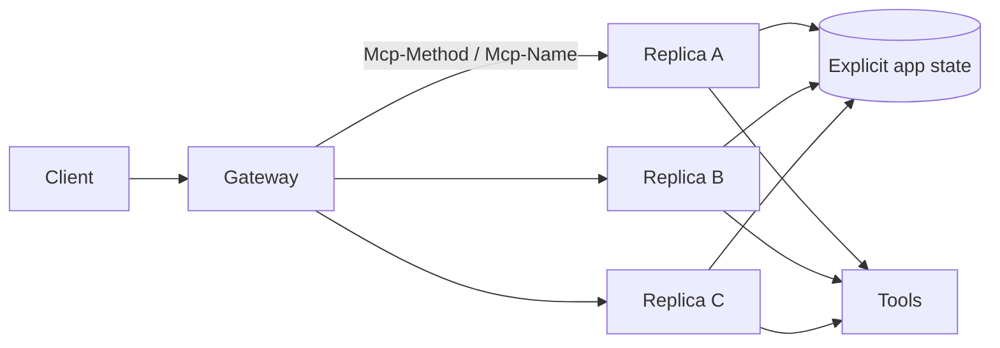

# MCP 2026-07-28 Stateless Core, Routing & Cache Semantics

**Seviye:** Mid → Principal  
**Alan:** Distributed Systems / Backend / AI Infrastructure

## Konu anlatımı
MCP 2026-07-28 protokol çekirdeğini stateful session modelinden stateless request/response modeline taşıdı. `initialize/initialized` handshake ve `Mcp-Session-Id` kaldırıldı; version/client/capability bilgisi request `_meta` alanında taşınabilir, optional `server/discover` capability discovery sağlar.

Distributed-systems sonucu nettir: protocol-level affinity kalktığı için herhangi bir request herhangi bir replica'ya gidebilir. Sticky session ve shared session-store protokol gereği değildir. Ancak application state kaybolmaz; workflow/task state explicit durable store, request payload veya extension contract ile yönetilir.

Streamable HTTP `Mcp-Method` ve `Mcp-Name` header'ları gateway routing/authorization/rate limiting'i body inspection'dan ayırır. `ttlMs` ve `cacheScope` list/resource caching'in freshness ve sharing boundary'sini explicit hale getirir. W3C Trace Context propagation tool zincirinde distributed tracing sağlar.

## Mental model

**Invariant:** Stateless protocol, stateless application değildir. Correctness state'in request'ten veya durable state'ten yeniden kurulabilmesini gerektirir.

## İçeride ne oluyor?
- `MCP-Protocol-Version` wire contract'ı belirtir.
- Header/body method-name uyuşmazlığı reddedilmelidir.
- `server/discover` discovery'yi connection lifecycle'dan ayırır.
- Deterministic ordering + cache hints catalog churn'ünü azaltır.
- Yanlış `cacheScope` cross-user leakage yaratabilir.
- Retry edilen side-effectful tool idempotency/dedup ister.
- Long-running state Tasks extension veya application-owned store ile tutulabilir.

## Mülakat soruları
1. Stateless protocol ile stateless application farkı?
2. Sticky session kaldırmak scaling'i neden kolaylaştırır?
3. Header routing'in gateway avantajı nedir?
4. Cache scope/freshness hataları ne üretir?
5. Retry duplicate side effect nasıl önlenir?
6. Senior: version migration nasıl yapılır?
7. Staff: cache/auth/trace standardı nasıl kurulur?
8. Principal: multi-tenant state, auth, rate-limit ve blast radius nasıl sınırlandırılır?

## Beklenen cevap seviyesi
- **Mid:** stateless request/discovery/routing/cache ayrımı.
- **Senior:** retry/idempotency, freshness, migration, observability.
- **Staff:** gateway policy, replicas, tracing, tenant isolation.
- **Principal:** protocol evolution, SLO, security boundary ve extension governance.

## Mini alıştırma
Üç replica'lı server'da A'dan B'ye retry olan `tools/call` çiz; request state, durable state, idempotency key ve trace propagation'ı işaretle.

## Proje fikri
`stateless-mcp-gateway-lab`: round-robin üç replica, header routing/rate-limit, catalog cache, tracing ve duplicate retry chaos testi.

## Failure modes / production
Process-memory workflow state, fazla geniş cache scope, header/body consistency kontrolü eksikliği, kör retry, version skew ve eksik trace context temel hatalardır. Request/error rate, per-method latency, cache hit/stale serve, retry/dedup, auth deny, version distribution ve trace completeness izlenir.

## Kaynaklar
- MCP 2026-07-28 release: https://blog.modelcontextprotocol.io/posts/2026-07-28/
- MCP 2026-07-28 RC details: https://blog.modelcontextprotocol.io/posts/2026-07-28-release-candidate/
- MCP Roadmap, 22 Ağustos 2026: https://blog.modelcontextprotocol.io/posts/mcp-roadmap/
