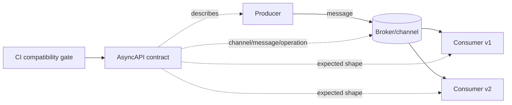

# AsyncAPI 3.1, Event Contracts & Evolution

## Konu anlatımı
Event-driven sistemlerde producer ve consumer bağımsız deploy edildiği için event contract payload şemasından büyüktür: channel/address, message, operation, protocol binding, security ve compatibility policy birlikte sözleşmeyi oluşturur. AsyncAPI bunu makinece okunabilir hale getirir. AsyncAPI 3.1.0, 31 Ocak 2026'da breaking olmayan minor release olarak yayımlandı ve ROS 2 binding ekledi.

Contract-first yaklaşım CI validation, generated documentation/code, ownership discovery ve breaking-change gate üretir; fakat runtime compatibility ayrıca schema registry, rollout ve consumer davranışına bağlıdır.

## Mental model

**Invariant:** Bağımsız deploy edilen eski consumer'ların okuyabildiği veri kümesini daraltan değişiklik breaking change'dir; versioning veya kontrollü rollout gerekir.

## İçeride ne oluyor?
- AsyncAPI 3.x `channels` ile adres/message'ı, `operations` ile send/receive davranışını ayırır.
- Protocol bindings transport ayrıntılarını core contract'tan ayırır.
- Additive optional field genellikle required-field veya semantic meaning değişiminden daha güvenlidir.
- CloudEvents `id`, `source`, `type`, `specversion` gibi ortak envelope metadata sağlayabilir; business schema'nın yerine geçmez.
- Consumer-driven compatibility testleri enum expansion, ordering, duplicate delivery ve default/null semantics gibi syntax dışı varsayımları da kapsamalıdır.

## Mülakat soruları
1. Event contract ile payload schema farkı nedir?
2. AsyncAPI ve OpenAPI hangi problem alanlarını çözer?
3. Optional field eklemek neden tamamen risksiz değildir?
4. At-least-once delivery contract tasarımını nasıl etkiler?
5. Senior: producer + 20 consumer için breaking-change rollout'u nasıl yapılır?
6. Staff: schema registry, AsyncAPI, CI ve ownership nasıl bağlanır?
7. Principal: event version sprawl nasıl kontrol edilir?

## Beklenen cevap derinliği
- **Mid:** channel/message/operation/schema ayrımı ve backward compatibility.
- **Senior:** rollout, replay, duplicates ve semantic compatibility.
- **Staff:** registry, CI gate, ownership ve deprecation workflow.
- **Principal:** taxonomy, governance, platform standardı ve delivery-speed trade-off'u.

## Mini alıştırma
`OrderCreated(orderId,currency,total)` v1'ini discounts, payment state ve multi-currency gereksinimleri için evrimleştir. Breaking noktaları ve rollout sırasını yaz.

## Proje fikri
İki producer ve üç consumer'lı Kafka/NATS laboratuvarı kur; AsyncAPI 3.1, JSON Schema, CI compatibility gate ve replay testleri ekle.

## Failure modes / trade-off / production
Spec'i yalnız dokümantasyon yapmak, semantic breaking change'i kaçırmak, consumer ownership bilmemek, enum genişlemesini hesaba katmamak, sonsuz version yaşatmak ve PII yaymak başlıca risklerdir. Schema/version dağılımı, deserialize error, unknown enum, DLQ, lag ve deprecated-version trafiği izlenmelidir.

## Kaynaklar
- https://www.asyncapi.com/blog/release-notes-3.1.0
- https://www.asyncapi.com/
- https://cloudevents.io/
