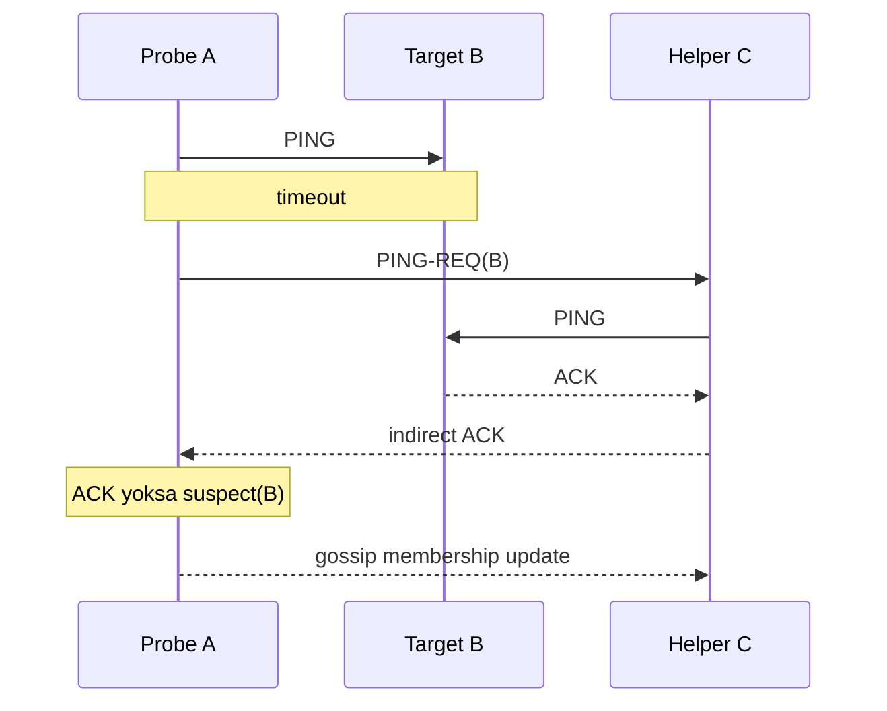

# SWIM: Failure Detection, Gossip Membership & Suspicion

## Konu anlatımı
Dağıtık sistemde “node öldü” doğrudan gözlenmez; timeout ve mesaj davranışı gözlenir. All-to-all heartbeat kötü ölçeklenebilir. SWIM failure detection ile membership dissemination'ı ayırır: rastgele peer'e direct `PING`, timeout sonrası başka peer'ler üzerinden `PING-REQ`, ardından gerekiyorsa `suspect` durumu. Membership değişiklikleri probe trafiğine piggyback edilip epidemic/gossip biçiminde yayılır.

Orijinal SWIM çalışmasının hedefi member başına beklenen probe/message yükünü cluster boyutundan bağımsız tutarken hızlı detection ve eventual membership convergence sağlamaktır. Ancak failure detector consensus değildir; partition, packet loss veya CPU starvation yaşayan sağlıklı node yanlış şüpheli görünebilir.

## Mental model

**Invariant:** suspect/dead membership state distributed lock, fencing token veya linearizable ownership kanıtı değildir.

## İçeride ne oluyor?
- Randomized probing all-to-all heartbeat yükünü azaltır.
- Indirect probe, tek bir A↔B path problemine karşı farklı ağ yollarını dener.
- Suspicion window false-positive ile detection latency arasında trade-off'tur.
- Incarnation number, eski suspect/dead bilgisinin daha yeni alive state ile refute edilmesine yardım eder.
- Piggyback gossip hızlı yayılım sağlar; implementation'lar full-state anti-entropy ekleyebilir.
- HashiCorp memberlist SWIM tabanlıdır; Lifeguard uzantıları local-health awareness ile CPU starvation/network delay kaynaklı false positive'leri azaltmayı hedefler. memberlist BFT veya consensus değildir.

## Mülakat soruları
1. Timeout neden failure kanıtı değildir?
2. Direct + indirect probe neden kullanılır?
3. Suspicion neden hemen `dead` demekten iyidir?
4. Senior: probe interval/timeout/suspicion nasıl tune edilir?
5. Staff: membership'i shard ownership için doğrudan kullanmanın riski nedir?
6. Staff: CPU-starved node false positive'lerini nasıl gözlemler ve azaltırsın?

## Beklenen cevap seviyesi
- **Junior:** timeout belirsizliği ve gossip fikrini açıklar.
- **Mid:** direct/indirect probe, suspicion ve incarnation'ı anlatır.
- **Senior:** false-positive/detection-latency, partition ve backpressure'ı tartışır.
- **Staff:** membership'i consensus/fencing'den ayırır; security, topology ve observability tasarlar.

## Mini alıştırma
5 node için probe turu çiz. A→B kaybolsun ama C→B çalışsın; sonra B gerçekten çöksün. Mesajları ve suspect/dead transition'larını yaz. Timeout'u yarıya indirmenin etkisini tartış.

## Proje fikri
`swim-lab`: 20 process membership simulator. Packet loss, asymmetric partition, CPU pause ve crash fault injection ekle. All-to-all heartbeat ile SWIM benzeri yaklaşımı messages/sec, detection latency, false positives ve convergence time ile karşılaştır.

## Failure modes / trade-off / production bağlantısı
Timeout'u kesin ölüm sanmak, suspicion'ı RTT dağılımından bağımsız seçmek, incarnation/refutation'ı yanlış uygulamak, membership'i fencing yerine kullanmak ve gossip kanalını authenticated varsaymak tipik hatalardır. Probe RTT/timeout, indirect-probe oranı, suspicion duration, refutation count, gossip backlog, convergence time ve local event-loop delay izlenmelidir.

## Kaynaklar
- Das, Gupta, Motivala — SWIM, DSN 2002: https://doi.org/10.1109/DSN.2002.1028914
- Cornell paper PDF: https://www.cs.cornell.edu/projects/Quicksilver/public_pdfs/SWIM.pdf
- HashiCorp memberlist: https://github.com/hashicorp/memberlist
- memberlist security model: https://github.com/hashicorp/memberlist/blob/master/SECURITY.md