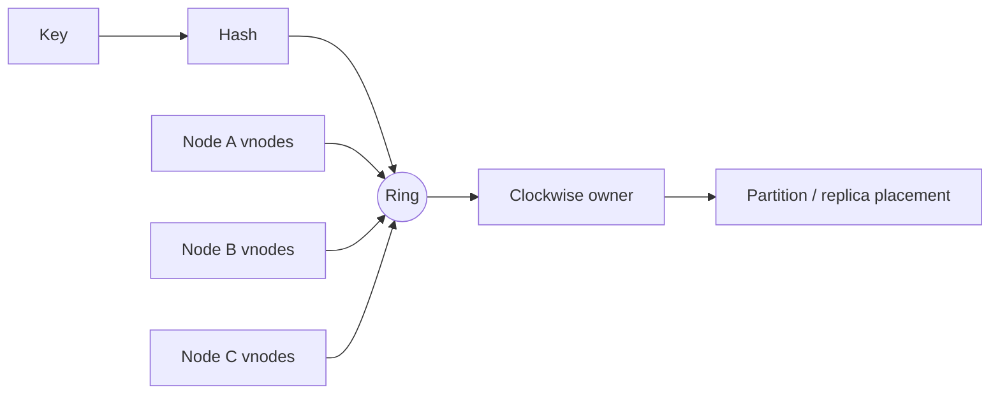

# Consistent Hashing, Virtual Nodes & Rebalancing

## Mental model
`hash(key) % N` node count değiştiğinde geniş remapping yapar. Consistent hashing node ve key'leri sabit hash uzayında tutup membership değişikliğinin etkisini lokalize eder.

## Temel kavramlar
- Key ve node token'ları aynı ordered hash space'tedir; key successor token'ın physical owner'ına gider.
- Node join/leave yalnız etkilenen ranges'i remap eder.
- Tek token/node random range-size skew yaratabilir.
- Virtual nodes fiziksel node'u çok sayıda küçük range ile temsil ederek variance'ı ve failure redistribution concentration'ını azaltabilir.
- Weighted token/vnode allocation heterogeneous capacity'yi modelleyebilir.
- Çok vnode metadata, routing/membership state ve movement planning maliyeti yaratır.
- Consistent hashing hot-key çözümü değildir; balanced key count balanced QPS/bytes anlamına gelmez.
- Replication factor ve rack/AZ-aware replica placement ayrı tasarım katmanlarıdır.

## Mülakat soruları
1. Modulo hashing node ekleme/çıkarma sırasında neden pahalıdır?
2. Consistent hashing'in temel garantisi nedir?
3. Vnodes neden kullanılır?
4. Vnode sayısını artırmanın maliyeti nedir?
5. Hot key neden ring dengeli olsa bile problem olabilir?
6. Senior: farklı kapasiteli node'ları nasıl ağırlıklandırırsın?
7. Staff: rebalancing blast radius ve foreground traffic interference nasıl sınırlanır?
8. Staff: rack/AZ-aware replication ring ownership'e nasıl eklenir?

## Beklenen cevap seviyesi
- **Junior:** modulo problemi, ring, clockwise owner.
- **Mid:** minimal remapping, vnode ve sorted-token lookup.
- **Senior:** weighted capacity, skew, replication, hot keys ve rebalance throttling.
- **Staff:** topology-aware placement, migration safety ve fleet observability.

## Mini alıştırma
0–99 ring'de A=10, B=40, C=75. Hash'leri 5,20,50,90 olan key'lerin owner'larını bul. D=60 eklendiğinde yalnız hangi interval'ın taşındığını göster ve `%3 -> %4` yaklaşımıyla karşılaştır.

## Proje
Weighted-vnode partitioner yaz. 1M synthetic key için node join/leave sonrası moved-key ratio, max/mean key load ve rebalance bytes ölç. Zipfian request distribution ekleyip key balance ile traffic balance farkını göster.

## Failure modes / production
Limitsiz rebalance, failure-domain awareness olmadan replica placement, key-count metric'ini load sanmak ve vnode metadata/migration overhead'ini yok saymak yaygın hatalardır. Partition bytes, QPS, p99, hottest-key share, movement bytes/sec, repair backlog ve node/rack/AZ skew birlikte izlenmelidir.

## Kaynaklar
- Karger et al. — Consistent Hashing and Random Trees, STOC 1997: https://doi.org/10.1145/258533.258660
- David Karger — publication record: https://people.csail.mit.edu/karger/papers.html
- DeCandia et al. — Dynamo, SOSP 2007: https://www.allthingsdistributed.com/files/amazon-dynamo-sosp2007.pdf
