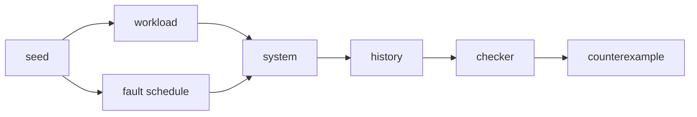

# Deterministic Fault Injection, Histories & Consistency Checking

## Mental model
A distributed correctness harness has three independent components: workload, fault schedule and checker.

Fault injection alone is not a correctness oracle. The important artifact is an operation history that can be checked against the system's claimed safety property.

## Workload, faults, checker
**Workload** generates semantic operations such as read/write/CAS or transactions. **Fault schedule** introduces process pauses/kills, network partitions, clock perturbations, storage faults or resource pressure. **History** records invocation and completion outcomes. **Checker** decides whether that history is compatible with the claimed model.

Timeouts require care: a client timeout does not prove that a write failed. The server may have committed it and lost the response. A harness that rewrites every timeout as a definite failure can manufacture false consistency violations or hide real ones.

## Linearizability
Linearizability asks whether each operation can appear to occur atomically at some point between invocation and response while preserving real-time precedence. It is a strong single-object model. Multi-object transactional claims may require serializability or strict serializability instead; choose the oracle from the product contract, not from tool convenience.

## Deterministic simulation
Controlling randomness, virtual time, scheduling/message delivery and fault choices makes rare interleavings reproducible. FoundationDB is notable for deterministic simulation as a core testing technique. Determinism improves replay but does not itself provide coverage: diverse seeds, schedule exploration, long runs and counterexample minimization remain necessary.

Jepsen 0.3.10, announced 2025-12-01, expanded controllable entropy/deterministic RNG support and integration with Antithesis-style deterministic simulation environments.

## Failure modes
- Random sleeps create flaky tests without a replayable schedule.
- "Cluster stayed up" tests availability, not safety.
- A simulator can omit real kernel/network/storage semantics.
- Production chaos is realistic but expensive and often nondeterministic.
- Testing only one consistency object can miss multi-object transaction anomalies.

## Layered strategy
Use deterministic simulation for broad schedule/fault exploration; targeted integration fault tests for real protocol/runtime behavior; a small number of production-safe game days for operational assumptions; and convert incident traces into regression seeds.

## Interview ladder
- **Senior:** workload/fault/checker separation, histories, unknown outcomes, linearizability intuition.
- **Staff:** deterministic scheduling, shrinking, fault composition, fidelity and coverage.
- **Principal:** consistency contract, release gates, risk-based fault portfolio and governance.

## Exercise
Create a 12-operation history for a three-node replicated register with a leader partition and a timeout on `write(x,2)`. Determine which final reads could be linearizable. Repeat after incorrectly assuming the timeout definitely means failure and explain the difference.

## Project
Build a three-process replicated register behind a deterministic fault proxy. Seed delay/drop/partition choices, record invocation/response history, implement a simple invariant checker, then replace it with a checker/model appropriate to the promised consistency semantics.

## Sources
- Jepsen Linearizability: https://jepsen.io/consistency/models/linearizable
- Jepsen Distributed Systems Safety Research: https://jepsen.io/
- FoundationDB deterministic simulation background: https://www.foundationdb.org/blog/fdb-paper/
- FoundationDB source and simulation tests: https://github.com/apple/foundationdb
