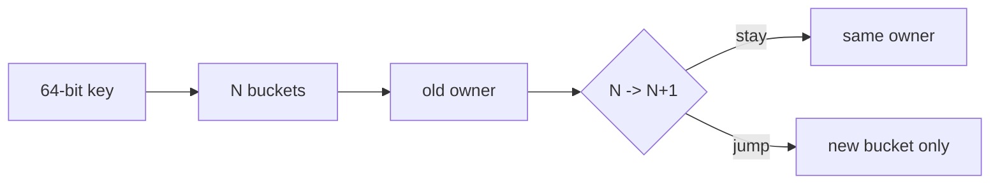

# Jump Consistent Hash, Minimal Churn & Shard Placement

## Neden önemli?
`hash(key) % N` basittir ama bucket sayısı değişince mapping'in büyük kısmını bozar. Jump Consistent Hash, 64-bit bir key'i ardışık numaralı bucket'lara deterministik ve dengeli biçimde atarken membership büyümesinde minimal churn hedefler; ring/vnode tablosu tutmaz.

## Mental model

Bucket sayısı `N`'den `N+1`'e çıkınca bir key ya yerinde kalır ya yalnız yeni bucket'a geçer. Dengeli durumda yaklaşık `1/(N+1)` key taşınır. Lookup O(log N) beklenen adım ve O(1) ek memory kullanır.

## Tasarım trade-off'ları
- State/table gerektirmemesi hot-path ve client-side routing için güçlüdür.
- Bucket'ların ardışık numaralı olması arbitrary node removal ve weighted/topology-aware placement'i doğrudan zorlaştırır.
- Logical bucket kimliği physical node kimliğinden ayrılmalıdır; node silinince bucket'ları yeniden numaralamak churn üretir.
- Replication ayrı problemdir. Primary hash fonksiyonunu körlemesine çoğaltmak failure-domain diversity sağlamaz.
- Hash function/seed ve placement algorithm bir data-layout contract'ıdır; migration sırasında versionlanmalıdır.

## Mülakat soruları
1. Modulo hashing neden membership değişiminde pahalıdır?
2. Minimal churn nasıl tanımlanır ve ölçülür?
3. Jump Hash ring+vnode yaklaşımına göre hangi state'i ortadan kaldırır?
4. Node removal'ı logical bucket indirection ile nasıl yönetirsin?
5. Replica/AZ-aware placement ve heterogeneous capacity nasıl eklenir?
6. Placement algorithm migration'ında dual-routing ve validation nasıl tasarlanır?

## Production checklist
Placement version, hash seed, logical-bucket map ve membership snapshot açıkça versionlanmalı. Canary/dual-compute ile eski-yeni placement karşılaştırılmalı. `moved-key ratio`, max/avg load, rebalance bytes, fallback routing ve replica failure-domain diversity izlenmelidir.

## Failure modes
Bucket ID'lerini node isimleriyle özdeşleştirmek, removal sırasında ID sıkıştırmak, hash seed'ini sessizce değiştirmek, replication'ı placement ile aynı problem sanmak ve farklı membership version'larına sahip client'ların aynı anda write ownership kararı vermesine izin vermek başlıca risklerdir.

## Mini proje
Modulo, ring+vnodes ve Jump Hash'i 1M key üzerinde 10→11→12 bucket geçişlerinde karşılaştır. Lookup throughput, memory, max/avg load ve moved-key ratio ölç. Sonra logical bucket→physical node indirection ekle.

## Kaynaklar
- Lamping & Veach, *A Fast, Minimal Memory, Consistent Hash Algorithm*: https://arxiv.org/abs/1406.2294
- Paper PDF: https://arxiv.org/pdf/1406.2294
