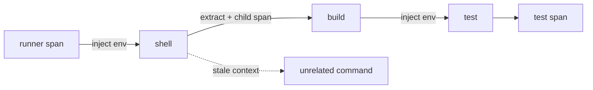

# OpenTelemetry Environment-Variable Context Propagation

## Problem
Distributed trace context çoğu zaman HTTP headers veya message metadata ile taşınır. CI runner → shell → build tool → test process gibi subprocess zincirlerinde protocol carrier olmayabilir. OpenTelemetry Specification Eylül 2026 itibarıyla environment variables'ı context carrier olarak kullanmak için release-candidate mekanizma tanımlıyor.

## Mental model

**Invariant:** Context propagation causality taşır; authentication veya authorization sağlamaz.

## Internals
Propagator trace context ve isteğe bağlı baggage'ı carrier'a inject/extract eder. Child process parent context'i extract edip yeni child span açar. Böylece process ağacı tek trace graph'ında görülebilir.

Environment inheritance'ın özel riski stale context'tir: shell uzun yaşarsa daha sonra başlatılan ilgisiz komut yanlış parent'a bağlanabilir. Bu nedenle lifecycle ve cleanup semantics önemlidir. Baggage transitive application data taşıdığı için privacy/cardinality riski vardır ve secret kanalı değildir.

Release-candidate özelliği production'a alırken SDK support matrix, polyglot interoperability testleri, sanitization ve version governance gerekir.

## Mülakat soruları
1. Trace context ile baggage farkı nedir?
2. Header olmayan subprocess boundary'de context nasıl taşınır?
3. Environment inheritance nasıl stale parentage yaratır?
4. Üçüncü taraf binary başlatılırken trust boundary nasıl ele alınır?
5. Polyglot CI platformunda propagation standardı nasıl rollout edilir?

## Seviye beklentisi
- **Mid:** parent/child span, inject/extract ve carrier kavramlarını açıklar.
- **Senior:** stale context, baggage privacy, inheritance ve sampling etkilerini tartışır.
- **Staff:** interoperability, sanitization, rollout ve telemetry cardinality policy tasarlar.
- **Principal:** organization-wide provenance/observability standardını security, cost ve incident response ile bağlar.

## Mini alıştırma
Parent → shell → child program zinciri kur. Parent context'i env'e inject etsin; child extract edip span açsın. Aynı shell'den ilgisiz komut başlatıp stale context riskini göster ve cleanup noktasını belirle.

## Proje
`process-trace-lab`: Go/Python/shell child process'lerini aynı trace'e bağlayan CI-benzeri orchestrator. Propagation açık/kapalı karşılaştırması, stale-context tests, baggage allowlist ve redaction ekle.

## Failure modes / production
Context'i auth token sanmak, baggage'a secret koymak, inherited env'i temizlememek, sampling etkisini yok saymak ve process invocation'larını yüksek-cardinality attributes ile doldurmak tipik hatalardır. Orphan spans, broken parent links, trace completeness, dropped telemetry, baggage size/redaction ve workflow başına span count izlenmelidir.

## Kaynaklar
- OpenTelemetry, 11 Eylül 2026: https://opentelemetry.io/blog/2026/environment-variable-context-propagation/
- OpenTelemetry Context Propagation: https://opentelemetry.io/docs/specs/otel/context/api-propagators/
- W3C Trace Context: https://www.w3.org/TR/trace-context/
- W3C Baggage: https://www.w3.org/TR/baggage/
