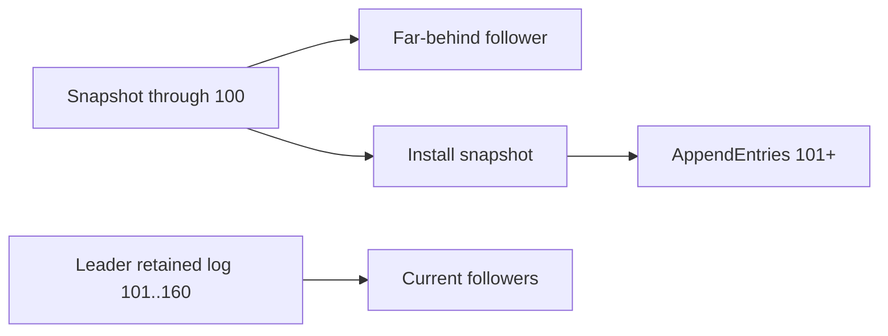

# Raft Log Compaction, Snapshots & Recovery

## Neden önemli?
Raft replicated log'u sınırsız büyüyemez. State machine belirli bir index'e kadar uygulanmış durumu snapshot olarak durable hale getirir; kapsanan log prefix'i compact edilebilir. Snapshot yalnız storage optimization değildir: restart/replay süresini ve çok geride replica'nın catch-up maliyetini de belirler.

## Mental model

## Temel invariant'lar
- Snapshot state ile `lastIncludedIndex` ve `lastIncludedTerm` birlikte anlamlıdır.
- Snapshot durable/atomik yayınlanmadan ona dayanan log prefix'i güvenle silinmemelidir.
- Follower gerekli prefix'i leader'da bulamıyorsa snapshot install yoluna geçilebilir.
- Snapshot sonrası yeni log suffix'i normal replication ile devam eder.
- Configuration/membership bilgisi recovery tasarımında korunmalıdır.

## Production trade-off'ları
Sık snapshot disk/log büyümesini ve recovery replay'ini azaltabilir fakat CPU, disk I/O, write amplification ve network transfer maliyeti doğurur. Seyrek snapshot normal path'i ucuzlatır fakat restart ve lagging replica catch-up süresini büyütür. Büyük state için snapshot generation/transfer foreground request'lerle resource contention yaratmamalıdır.

## Mülakat soruları
1. Raft log compaction neden gerekir?
2. `lastIncludedIndex/Term` ne işe yarar?
3. Leader'ın retained log'undan daha geride follower nasıl toparlanır?
4. Snapshot yarıda kalırken process crash olursa recovery nasıl güvenli tutulur?
5. Snapshot cadence hangi metriklerle ayarlanır?
6. Snapshot format upgrade'i rolling deployment'ta nasıl yönetilir?

## Beklenen cevap seviyesi
- **Mid:** log, state machine ve snapshot ilişkisi.
- **Senior:** install snapshot, durability, atomic publish ve recovery.
- **Staff:** I/O isolation, lagging replica, cadence ve observability.
- **Principal:** RTO, capacity economics, format evolution ve fleet-level risk.

## Mini alıştırma
Leader snapshot index 100, retained log 101–160; follower index 35. Catch-up akışını ve hangi noktada normal AppendEntries'e dönüldüğünü çiz.

## Proje fikri
`mini-raft-snapshot-lab`: threshold snapshot, crash-safe temp+rename publish, lagging follower install ve restart recovery senaryoları ekle. Snapshot size/duration, retained-log bytes ve catch-up time ölç.

## Failure modes
Durable olmayan snapshot'a güvenerek log silmek, snapshot metadata/state mismatch, transfer sırasında unbounded memory kullanmak, snapshot I/O ile foreground latency'yi bozmak ve yalnız log boyutuna bakıp recovery time'ı ölçmemek.

## Kaynaklar
- Raft paper: https://raft.github.io/raft.pdf
- Raft website: https://raft.github.io/
