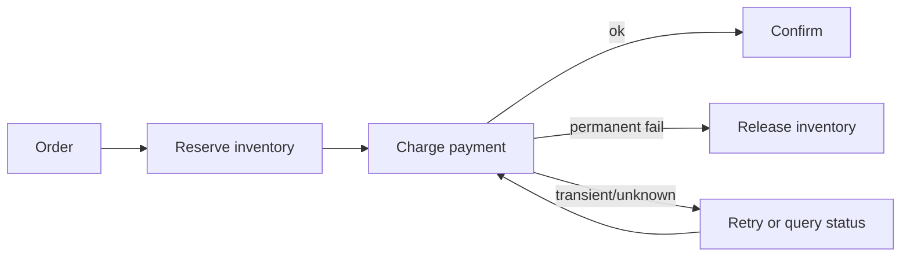

# Saga Compensation, Orchestration & Choreography

## Neden önemli?
Bir business transaction birden fazla servis ve datastore'a yayıldığında tek ACID transaction sınırı kaybolur. Saga işi local transaction'lara böler; sonraki adım kalıcı biçimde başarısız olduğunda önceki etkiler domain-specific compensating actions ile düzeltilir. Compensation klasik rollback değildir: başka işlemler araya girmiş olabilir ve bazı side effect'ler tam tersine çevrilemez.

## Mental model
Saga'yı büyük bir `BEGIN/COMMIT` değil, **durable business state machine** olarak düşün. Her transition için üç soru vardır: tekrar çalışırsa ne olur, timeout olursa gerçek sonucu nasıl öğrenirim, ileri mi giderim yoksa hangi compensation'ı çalıştırırım?

## Orchestration vs choreography
**Choreography** servislerin event'lere tepki vermesiyle coordination'ı dağıtır. Az katılımcıda hafif olabilir; graph büyüdükçe dependency ve debugging zorlaşır. **Orchestration** transition logic'ini durable coordinator'da açık hale getirir; branching ve observability kolaylaşır fakat orchestrator'ın availability, durability ve versioning'i kritik hale gelir.

## İçeride ne oluyor?
1. Her participant kendi local transaction'ını commit eder; global rollback log yoktur.
2. Step sonucu durable workflow state/event olarak kaydedilir.
3. Timeout `failed` demek değildir; outcome unknown olabilir. Retry idempotent olmalı veya remote status sorgulanmalıdır.
4. Compensation business semantic'tir: refund, releaseReservation, cancelShipment; byte-level undo değildir.
5. Compensation'ın kendisi de fail/retry olabilir; progress durable tutulur.
6. Saga isolation sağlamaz; concurrent sagalar intermediate state görebilir. Reservation, semantic lock veya version check gerekebilir.
7. Irreversible side effect'ler mümkünse point-of-no-return sonrasına taşınır; gerektiğinde human-intervention yolu tasarlanır.

## Mülakat soruları
1. Saga ile 2PC arasındaki temel trade-off nedir?
2. Compensation neden database rollback değildir?
3. Choreography ve orchestration ne zaman seçilir?
4. Payment timeout'unda double-charge yaratmadan nasıl ilerlersin?
5. Compensation da başarısız olursa ne yaparsın?
6. Staff: saga isolation eksikliğini inventory reservation örneğinde nasıl kontrol edersin?
7. Principal: organization çapında workflow platformu için durability, audit, ownership ve operability standardını nasıl belirlersin?

## Beklenen cevap derinliği
- **Junior/Mid:** local transaction, eventual consistency, compensation, idempotency.
- **Senior:** unknown outcome, durable state, retries, semantic locks, irreversible steps.
- **Staff:** orchestration/choreography sınırları, workflow versioning, observability, blast radius.
- **Principal:** platform-vs-library, domain ownership, audit/compliance ve operational economics.

## Mini alıştırma
`CreateOrder -> ReserveInventory -> ChargePayment -> BookShipment` akışında her step için retry policy, idempotency key ve compensation yaz. Payment timeout'unda `failed` varsaymadan karar ağacı oluştur.

## Proje fikri
`saga-lab`: order/inventory/payment için üç küçük servis ve durable orchestrator. Deterministic failure injection ekle; retry, duplicate delivery, compensation ve orchestrator restart senaryolarını test et. Trace'lerde saga ID kullan.

## Failure modes / trade-off / production
Duplicate message side effect'i iki kez çalıştırabilir; timeout unknown outcome yaratır; compensation irreversible external effect'i silemeyebilir; choreography dependency spaghetti'ye dönüşebilir. Orchestrator state'i durable olmalı ve tek failure point'i haline gelmemelidir. Stuck saga age, retry count, compensation failure, manual-intervention queue ve end-to-end completion latency izlenmelidir.

## Kaynaklar
- AWS Prescriptive Guidance — Saga patterns: https://docs.aws.amazon.com/prescriptive-guidance/latest/cloud-design-patterns/saga-patterns.html
- AWS Prescriptive Guidance — Saga orchestration: https://docs.aws.amazon.com/prescriptive-guidance/latest/cloud-design-patterns/saga-orchestration.html
- Azure Architecture Center — Compensating Transaction: https://learn.microsoft.com/en-us/azure/architecture/patterns/compensating-transaction
