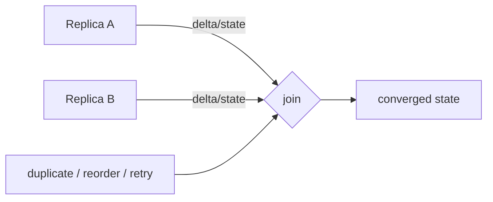

# CRDTs, Strong Eventual Consistency & Delta-State Replication

## Temel fikir
Network partition sırasında replica'lar bağımsız update kabul ediyorsa yeniden iletişim kurduklarında deterministik biçimde yakınsamaları gerekir. CRDT, conflict-resolution kuralını veri tipinin cebrine gömer. “Conflict yok” değil; conflict'in merge semantiği önceden tanımlıdır.

## Mental model
State-based merge'i küme birleşimi gibi düşün: mesaj tekrar veya reorder olsa da sonuç değişmemelidir. Delta-state her senkronizasyonda bütün kitabı değil yeni sayfaları gönderip aynı join kuralını korur.

## State-based ve operation-based
State-based CvRDT replica state'lerini değiş tokuş eder. Join-semilattice üzerinde merge associative, commutative ve idempotent olduğunda duplicate ve reorder convergence'ı bozmaz. Operation-based CmRDT operasyon yayar; delivery varsayımları daha kritiktir. Delta-state CRDT full state yerine küçük delta-state'ler üretip state-based join özelliklerini korumayı hedefler.

## Sayaç örneği
G-Counter state'i `replica_id -> monoton counter` map'idir. Her replica yalnız kendi component'ini artırır. Merge component-wise `max`; read component toplamıdır. PN-Counter increment ve decrement için iki grow-only counter kullanabilir.

## Set ve causal context
Remove içeren set'lerde yalnız değer saklamak yetmez. Observed-remove tasarımında benzersiz tags/causal context hangi add olaylarının remove tarafından gerçekten görüldüğünü ayırır. Aksi halde gecikmiş add, silinmiş değeri yanlışlıkla diriltebilir.

## Strong eventual consistency
Aynı update kümesini görmüş doğru replica'lar eşdeğer logical state'e yakınsar. Bu convergence garantisi global invariant garantisi değildir. `balance >= 0`, global uniqueness veya kapasite sınırı gibi invariant'lar koordinasyon gerektirebilir.

## Metadata ve garbage collection
Replica IDs, causal metadata ve tombstone'lar büyüyebilir. GC için hangi replica'nın hangi geçmişi kesin gördüğünü bilmek gerekir; bu da membership, causal knowledge veya koordinasyon problemini geri getirir. Delta replication bandwidth'i azaltır fakat anti-entropy, delta retention ve recovery hâlâ tasarlanmalıdır.

## Failure modes / trade-off
- Yanlış merge: sessiz divergence.
- Tombstone/ID büyümesi: storage ve transfer maliyeti.
- Replica retirement: eski causal kimliklerin güvenli temizlenmesi.
- Delete/compliance: “eventual remove” ürün veya regülasyon beklentisine uymayabilir.
- Global invariant: CRDT tek başına consensus/transaction yerine geçmez.

## Production gözlemlenebilirliği
Replica lag, convergence delay, anti-entropy bytes, merge duration, metadata/state ratio, tombstone count ve invariant-violation sinyalleri izlenmelidir.

## Mülakat soruları
1. Eventual consistency ile strong eventual consistency farkı nedir?
2. State-based merge neden idempotent olmalıdır?
3. G-Counter neden duplicate/reorder'a dayanır?
4. OR-Set neden causal metadata ister?
5. Tombstone GC neden dağıtık sistem problemidir?
6. Staff: CRDT ile consensus sınırını nerede çizersin?
7. Principal: offline-first üründe convergence, delete semantics ve maliyeti nasıl yönetirsin?

## Kısa alıştırma
İki replica partition sırasında sırasıyla üç ve iki increment yapsın. Duplicate ve ters sıralı state delivery ile component-wise max'ın 5'e yakınsadığını göster; sonra aynı yaklaşımın set remove için neden yetersiz olduğunu açıkla.

## Proje
Üç replica'lı G-Counter ve observed-remove set simülatörü yaz. Network mesaj drop/reorder/duplicate üretsin. Anti-entropy sonunda convergence property testi ekle; full-state ile delta-state transfer miktarını karşılaştır.

## Kaynaklar
- Shapiro et al., Conflict-Free Replicated Data Types: https://hal.science/inria-00609399
- Almeida, Shoker, Baquero, Delta State Replicated Data Types: https://arxiv.org/abs/1603.01529
- Preguiça, Baquero, Shapiro, CRDT overview: https://arxiv.org/abs/1805.06358
