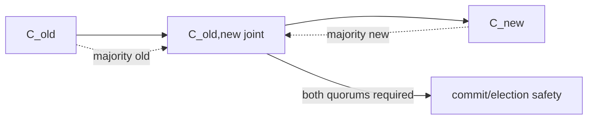

# Raft Membership Changes & Joint Consensus

**Seviye:** Mid → Principal

## Konu anlatımı
Consensus cluster'ında node eklemek veya çıkarmak yalnız config değiştirmek değildir; quorum tanımı değişir. `C_old` ile `C_new` arasında doğrudan atlama, farklı majorities'in aynı anda karar verebilmesine yol açabilecek güvenlik boşluğu yaratabilir. Raft'ın klasik joint-consensus yaklaşımı geçişte `C_old,new` ara configuration'ını kullanır; election ve commitment için hem eski hem yeni configuration majority'si gerekir. Joint configuration commit edildikten sonra final `C_new` log entry'si replike edilir.

Membership normal replicated log üzerinden ilerlediği için configuration state-machine history'nin parçasıdır. Ana mental model, quorum güvenliğinin yalnız node sayısından değil ardışık configuration'ların majority-intersection koşulundan gelmesidir.

## Mental model

## İçeride ne oluyor?
1. Leader membership-change entry'sini replicated log'a ekler.
2. Joint config aktifken quorum hem old hem new majority ister.
3. Bu, transition sırasında disjoint majority'nin tek taraflı kararını engeller.
4. Joint entry committed olduğunda final new-config entry üretilir.
5. Removed server final config sonrası quorum'dan çıkar; process shutdown ayrı lifecycle işidir.
6. Leader transition ortasında ölürse yeni leader configuration'ı committed/log state'inden türetir; side-channel mutable config güvenli değildir.

## Yüksek getirili mülakat soruları
1. 3 node'dan 5 node'a tek adım config değişimi neden risklidir?
2. Joint consensus hangi iki majority'yi ister?
3. Membership neden replicated log'un parçası olmalıdır?
4. Leader transition ortasında ölürse hangi config kullanılır?
5. Node remove ile process shutdown neden aynı değildir?
6. Senior: lagging yeni node'u voter yapmak availability'yi nasıl etkiler?
7. Staff/Principal: autoscaling ile consensus membership'i neden doğrudan bağlamazsın?

## Seviyeye göre cevap
**Mid:** quorum/majority ve membership safety etkisini açıklar. **Senior:** joint config, log ordering, leader failure ve catch-up riskini tartışır. **Staff:** reconfiguration API, sequencing, telemetry ve guardrail tasarlar. **Principal:** failure domains, quorum placement, automation rate limits ve regional migration stratejisini bağlar.

## Kısa alıştırma
`C_old={A,B,C}`, `C_new={B,C,D,E,F}` için majority boyutlarını hesapla. Joint phase'te yalnız `B,C,D` ACK verirse iki quorum koşulunu ayrı ayrı değerlendir.

## Proje fikri
`raft-membership-sim`: old → joint → new geçişini, leader crash'i, lagging node ve concurrent reconfiguration rejection senaryolarını modelleyen küçük state machine ve property tests yaz.

## Failure modes / trade-off / production
Concurrent membership changes state-space'i büyütür; implementations çoğu kez değişiklikleri serialize eder. Catch-up olmadan voter eklemek quorum availability'yi düşürür. Removed node'un eski config ile yaşamaya devam etmesi operational split-brain belirtileri yaratabilir. Active config/version, voter health, replication lag, joint-state duration, rejected changes, leader changes ve quorum margin izlenmelidir.

## Kaynaklar
- Raft publications/extended paper: https://raft.github.io/
- Ongaro & Ousterhout — Raft paper: https://raft.github.io/raft.pdf
- Ongaro dissertation: https://web.stanford.edu/~ouster/cgi-bin/papers/OngaroPhD.pdf
