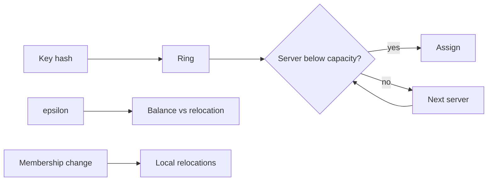

# Consistent Hashing with Bounded Loads

**Seviye:** Mid → Principal  
**Alan:** Algorithms / Distributed Systems / System Design

## Neden var?
Klasik consistent hashing'in temel gücü membership değişiminde az sayıda key'i yeniden yerleştirmesidir; tek başına sıkı load-balance garantisi vermez. Hot key, heterojen kapasite ve rastgele dağılım varyansı bazı node'ları aşırı yükleyebilir. Bounded-load yaklaşımı, her server için ortalama yükün yaklaşık `(1+ε)` katı bir kapasite sınırı tanımlayıp key'i hash konumundan başlayarak kapasitesi olan ilk server'a yönlendirir.

## Mental model

## Temel mekanik
- Yaklaşık capacity: `ceil((1+ε) * key_count/server_count)`.
- Küçük `ε`: daha sıkı denge, fakat daha fazla relocation/cascade riski.
- Büyük `ε`: daha gevşek denge, daha fazla placement stabilitesi.
- Virtual nodes varyansı azaltabilir ama hot-key problemini çözmez.
- Heterogeneous fleet'te capacity CPU/memory/storage weight ile ölçeklenebilir.
- Hash key seçimi placement semantics'idir: tenant ID stickiness sağlar; request-level key daha fazla yayılım sağlayabilir.

## Mülakat soruları
1. Consistent hashing hangi problemi çözer, hangisini çözmez?
2. Virtual node neden dengeyi iyileştirir ama garanti etmez?
3. `ε` küçüldükçe relocation neden artabilir?
4. Tek hot key varsa bounded-load hashing yeterli midir?
5. **Senior:** weighted capacity ve cache locality nasıl birlikte modellenir?
6. **Staff/Principal:** ring hash, rendezvous hashing ve Maglev'i remapping, lookup cost, operability ve SLO açısından karşılaştır.

## Beklenen cevap derinliği
- **Mid:** ring, remapping, overflow/capacity modelini açıklar.
- **Senior:** skew, weights, hot key ve locality trade-off'larını bağlar.
- **Staff:** churn, failover, telemetry ve rollout tasarlar.
- **Principal:** algoritmik garantileri multi-tenant isolation, cost ve SLO hedeflerine çevirir.

## Kısa alıştırma
3 server ve 12 key için ortalama yük 4'tür. `ε=0.25` için kapasite sınırını hesapla. Bir server kaldırıldığında moved-key ratio, max/mean load, cache miss ve p99 latency'yi birlikte yorumla.

## Proje fikri
`hashing-lab`: ring hash, rendezvous hash ve bounded-load varyantını Zipf popularity, node churn ve heterogeneous weights altında simüle et. Max/mean load, moved-key ratio ve simulated cache-hit oranını raporla.

## Failure modes / trade-off
Uniform-hash varsayımı tenant skew'unda kırılabilir. Tek hot key request-count kapasitesini anlamsızlaştırabilir. Membership flap relocation fırtınası yaratabilir. Router'lar farklı membership epoch görürse placement ayrışabilir. Balance, movement, cache locality ve metadata consistency birlikte ele alınmalıdır.

## Production bağlantısı
Load balancer, cache shard, storage partition ve tenant placement tasarımında kullanılır. `membership_epoch`, max/mean load, remap rate, hot-key concentration, cache-hit ve tail latency birlikte izlenmelidir.

## Kaynaklar
- Google Research — Consistent Hashing with Bounded Loads: https://research.google/pubs/consistent-hashing-with-bounded-loads/
- Google Research Blog: https://research.google/blog/consistent-hashing-with-bounded-loads/
- Envoy — Load balancers / Maglev & ring hash: https://www.envoyproxy.io/docs/envoy/latest/intro/arch_overview/upstream/load_balancing/load_balancers.html
