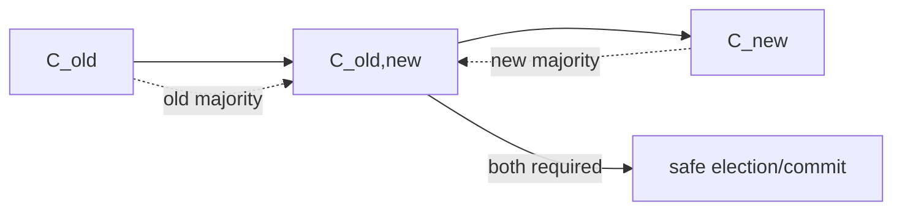

# Raft Membership Changes & Joint Consensus

## Konu anlatımı
Consensus cluster'ında membership değiştirmek quorum tanımını değiştirir. `C_old` ile `C_new` arasında kontrolsüz tek-adım geçiş, farklı majorities'in eşzamanlı karar verebilmesi riskini doğurur. Raft'ın klasik joint-consensus yaklaşımı ara `C_old,new` configuration'ında election ve commitment için hem eski hem yeni configuration majority'sini ister. Joint configuration commit edildikten sonra final `C_new` entry'si replike edilir.

Membership configuration replicated log'un parçasıdır; bu sayede leader değişse bile cluster'ın hangi quorum kurallarında olduğu log history'den türetilebilir.

## Mental model

## İçeride ne oluyor?
1. Leader membership-change entry'sini log'a ekler ve replicate eder.
2. Joint phase'te quorum hesabı hem old hem new majority ister.
3. Bu majority intersection transition safety'yi korur.
4. Joint entry committed olduktan sonra final new-config entry üretilir.
5. Removed server'ın quorum'dan çıkması ile process shutdown ayrı lifecycle adımlarıdır.
6. Leader failure/retry sırasında configuration side-channel dosyadan değil replicated state'ten türetilir.

## Mülakat soruları
- 3 node'dan 5 node'a tek adım config değişimi neden risklidir?
- Joint consensus hangi majorities'i ister?
- Membership neden replicated log'da olmalıdır?
- Leader transition ortasında ölürse ne olur?
- Node remove ile process shutdown neden aynı değildir?
- Lagging node'u voter yapmak availability'yi nasıl etkiler?
- Autoscaling neden doğrudan consensus membership automation'ına bağlanmamalıdır?

## Beklenen cevap seviyesi
- **Mid:** quorum/majority ve membership safety ilişkisi.
- **Senior:** joint config, log ordering, leader failure ve catch-up.
- **Staff:** serialized reconfiguration API, guardrails ve observability.
- **Principal:** failure-domain placement, automation rate limits ve regional migration.

## Mini alıştırma
`C_old={A,B,C}`, `C_new={B,C,D,E,F}` için majority boyutlarını hesapla. Joint phase'te yalnız `B,C,D` ACK verirse iki quorum açısından commit kararını göster.

## Proje fikri
`raft-membership-sim`: old → joint → new quorum state machine'i; leader crash, lagging node ve concurrent change rejection için property tests ekle.

## Failure modes / trade-off
Concurrent membership changes state-space'i büyütür; değişiklikleri serialize etmek yaygın guardrail'dir. Catch-up olmadan voter eklemek quorum availability'yi düşürebilir. Removed node'un eski config ile çalışması operasyonel split-brain belirtileri doğurabilir.

## Production bağlantısı
Active config/version, voter health, replication lag, joint-state duration, rejected config changes, leader changes ve quorum margin izlenmelidir. Membership automation capacity autoscaling'den daha muhafazakâr olmalıdır.

## Kaynaklar
- Raft publications: https://raft.github.io/
- Ongaro & Ousterhout — In Search of an Understandable Consensus Algorithm: https://raft.github.io/raft.pdf
- Ongaro PhD dissertation: https://web.stanford.edu/~ouster/cgi-bin/papers/OngaroPhD.pdf
