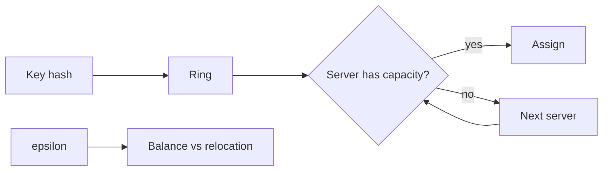

# Consistent Hashing with Bounded Loads

## Amaç
Consistent hashing membership değişiminde az key taşımayı hedefler; tek başına sıkı load-balance garantisi vermez. Bounded-load yaklaşımı her server için ortalama yükün `(1+ε)` katı civarında capacity sınırı koyarak **stability + balance** hedeflerini birlikte ele alır.

## Mental model ve internals
Key ve server'lar deterministik hash uzayına yerleşir. Bir key kendi konumundan itibaren kapasitesi olan ilk server'a gider. Yaklaşık capacity `ceil((1+ε) * m/n)` olarak düşünülebilir. Küçük ε daha sıkı denge sağlar fakat değişikliklerde daha fazla key hareketi doğurabilir; büyük ε daha çok headroom ve stabilite verir.

Virtual node'lar variance'ı azaltabilir ama hot-key ve adversarial/tenant skew problemini çözmez. Heterojen makinelerde capacity CPU/memory/storage weight ile ilişkilendirilmelidir. Hash key seçimi de semantiğin parçasıdır: tenant ID locality/stickiness verirken request-level key daha iyi yayılım sağlayabilir.

Google Research'ün bounded-load çalışması, kapasite sınırı ile update başına beklenen relocation maliyetini sistem boyutundan bağımsız tutabilen garantiler gösterir. Production load balancer'larda ring hash ve Maglev aynı tasarım uzayındaki pratik seçeneklerdir; lookup cost, remapping, weighting ve cache locality birlikte değerlendirilir.

## Mülakat soruları ve beklenen derinlik
1. Consistent hashing neyi garanti eder, neyi etmez?
2. Virtual node neden yardımcı olur ama hot key'i çözmez?
3. ε küçülünce balance ve relocation nasıl değişir?
4. Node ekleme/çıkarma sırasında hangi key'ler hareket eder?
5. Senior: heterogeneous capacity ve tenant stickiness'i nasıl modelliyorsun?
6. Staff: cache hit-rate ile load balance çatışırsa nasıl karar verirsin?
7. Principal: ring hash, rendezvous ve Maglev'i remapping/failure/operability açısından karşılaştır.

- **Mid:** ring, deterministic placement ve remapping'i açıklar.
- **Senior:** ε, skew, weights ve locality trade-off'larını bağlar.
- **Staff:** membership churn, failover ve telemetry tasarlar.
- **Principal:** algoritmik garantileri SLO, cost ve isolation hedeflerine çevirir.

## Kısa alıştırma
3 server ve 12 key için `ε=0.25` altında capacity sınırını hesapla. Bir server kaldırıldığında moved-key ratio, max/mean load, cache miss ve p99 latency'yi birlikte değerlendir.

## Proje fikri
Ring hash, rendezvous hash ve bounded-load varyantını Zipf popularity, node churn ve heterogeneous weights altında simüle et; max/mean load, moved-key ratio ve cache-hit oranını ölç.

## Failure modes / trade-off / production
Uniform-hash varsayımı tenant skew ile kırılabilir; tek hot key request-count capacity'sini anlamsızlaştırabilir. Membership flap relocation storm yaratabilir. Router'ların membership epoch/capacity metadata'sı ayrışırsa aynı key farklı backend'e gidebilir. Production'da membership epoch, remap rate, max/mean load, hot-key concentration, cache-hit ve tail latency izlenmelidir.

## Kaynaklar
- Google Research — Consistent Hashing with Bounded Loads: https://research.google/pubs/consistent-hashing-with-bounded-loads/
- Google Research Blog: https://research.google/blog/consistent-hashing-with-bounded-loads/
- Envoy — Supported load balancers: https://www.envoyproxy.io/docs/envoy/latest/intro/arch_overview/upstream/load_balancing/load_balancers.html
