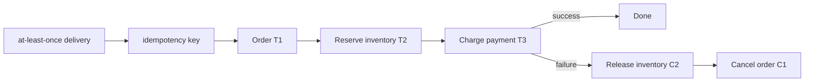

# Sagas, Compensation Semantics & Isolation Gaps

## Konu anlatımı
Saga, uzun veya servisler arası bir iş akışını tek global ACID transaction yerine bir dizi kısa transaction'a böler. `T1..Tn` adımları local olarak commit olur; sonraki adım başarısız olduğunda daha önce tamamlanan iş `C_i` compensating transaction'larla semantik olarak düzeltilir. Compensation database rollback değildir: dış dünyaya görünmüş bir rezervasyonu iptal etmek veya tahsilatı iade etmek gibi yeni bir business operation'dır.

Modern servis mimarilerinde iki yaygın coordination stili vardır. **Choreography** servislerin event'lere tepki vermesiyle ilerler; workflow state sistem geneline dağılabilir. **Orchestration** durable coordinator'ın sıradaki forward/compensation adımını izlemesidir; observability ve policy merkezi olur, fakat coordinator kritik control-plane bileşenidir.

Saga atomicity illusion'ı vermez. Local commits arasındaki intermediate state başka işlemlerce görülebilir. Bu yüzden isolation anomaly, duplicate delivery, compensation failure, irreversible side effect ve concurrent saga conflict'leri tasarımın bir parçasıdır.

## Mental model

## İçeride ne oluyor?
1. Her forward step kendi local transaction'ında commit olur; global rollback log'u yoktur.
2. Compensation exact inverse olmak zorunda değildir; business-equivalent corrective action'dır.
3. At-least-once delivery nedeniyle forward ve compensation handler'ları idempotent tasarlanmalıdır.
4. Transactional outbox/CDC, local DB commit ile event publication arasındaki dual-write boşluğunu azaltır.
5. Isolation kaybı semantic lock/status (`PENDING`), version check, commutative update veya reread gibi tekniklerle yönetilebilir.
6. Irreversible side effect'ler mümkün olduğunca pivot point sonrasına bırakılır; email veya fiziksel shipment klasik rollback değildir.
7. Durable orchestration'da workflow history/replay, retry policy ve compensation state production correctness'in parçasıdır.

## Yüksek getirili mülakat soruları
1. Saga ile 2PC arasındaki consistency/availability trade-off nedir?
2. Compensation neden `ROLLBACK` değildir?
3. Choreography ne zaman orchestration'dan daha kötü hale gelir?
4. Outbox hangi failure window'unu kapatır, hangilerini kapatmaz?
5. Senior: payment başarılı, inventory compensation başarısızsa ne yaparsın?
6. Staff: iki concurrent saga aynı inventory üzerinde çalışırken hangi invariant'ları korursun?
7. Principal/CTO: hangi business flow'larda saga'yı reddedip stronger transaction boundary seçersin?

## Beklenen cevap derinliği
- **Mid:** local transaction + compensation ve eventual consistency modelini açıklar.
- **Senior:** idempotency, outbox, retries ve isolation anomaly'lerini tasarıma bağlar.
- **Staff:** durable orchestration, concurrency control, observability ve manual-repair yolunu tasarlar.
- **Principal/CTO:** bounded-context sınırları, financial/legal irreversibility, ownership ve blast radius üzerinden pattern seçer.

## Kısa alıştırma
Order → reserve stock → charge card akışında charge başarılı olduktan sonra process crash ediyor ve aynı command tekrar geliyor. Idempotency key, persisted workflow state ve compensation kullanarak duplicate charge oluşmayacağını gösteren state machine çiz.

## Proje fikri
`saga-lab`: order/inventory/payment workflow kur. Outbox tablosu ve at-least-once worker ekle. Her adımdan sonra crash inject et; duplicate command, timeout ve compensation failure senaryolarında invariant'ları property test ile doğrula.

## Failure modes / trade-off / production
Compensation'ın kendisi başarısız olabilir; retry sonsuz side effect üretebilir; choreography event cycle veya görünmeyen dependency yaratabilir; orchestration coordinator overload olabilir. Production'da stuck saga age, step/compensation retry count, idempotency conflicts, outbox lag, manual-repair queue, business invariant violations ve end-to-end completion latency izlenmelidir.

## Kaynaklar
- Garcia-Molina & Salem — Sagas, SIGMOD 1987: https://doi.org/10.1145/38713.38742
- Princeton technical report — SAGAS: https://www.cs.princeton.edu/techreports/598
- Temporal documentation — durable execution: https://docs.temporal.io/
