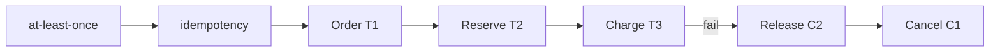

# Sagas, Compensation Semantics & Isolation Gaps

## Neden önemli?
Servisler arası business workflow'larda tek global ACID transaction çoğu zaman uygulanabilir veya arzu edilir değildir. Saga, uzun işi kısa local transaction'lara böler ve partial success'i compensating transaction'larla yönetir. Kritik nokta: compensation rollback değildir; commit olmuş ve gözlemlenmiş bir etkiyi business semantics ile düzeltir.

## Mental model

## Temel model
Garcia-Molina ve Salem'in Saga modelinde uzun transaction `T1..Tn` olarak parçalanır. Başarı yolunda bütün adımlar tamamlanır; partial execution sonrası gerekli compensations çalışır. Local commit'ler arasında intermediate state görünür olabileceğinden klasik isolation guarantee'si yoktur.

Modern sistemlerde choreography event-driven dağıtık coordination sunarken orchestration durable bir coordinator ile workflow state'i merkezileştirir. Choreography küçük ve gevşek akışlarda basit olabilir; karmaşık branching, timeout ve compensation zincirlerinde reasoning zorlaşır. Orchestration observability ve policy'yi kolaylaştırır ama coordinator'ın durability/capacity tasarımı gerekir.

## Correctness araçları
- Forward ve compensation handler'larını idempotent yap.
- DB commit + event publish dual-write boşluğu için transactional outbox/CDC kullan.
- Intermediate state conflict'leri için semantic lock/status, version check veya commutative operation düşün.
- Irreversible side effect'leri mümkünse pivot point sonrasına koy.
- Compensation failure için bounded retry + durable manual-repair yolu tasarla.
- Workflow state/history'yi restart sonrası devam edecek şekilde persist et.

## Mülakat soruları
1. Saga ile 2PC arasındaki trade-off nedir?
2. Compensation neden rollback değildir?
3. Choreography vs orchestration nasıl seçilir?
4. Outbox hangi failure window'unu kapatır?
5. Duplicate delivery altında exactly-once business effect nasıl yaklaşılır?
6. Concurrent saga'larda isolation anomaly nasıl azaltılır?
7. Principal/CTO: hangi invariant'larda saga yerine stronger transaction boundary seçersin?

## Seviye beklentisi
- **Mid:** local transaction + compensation + eventual consistency.
- **Senior:** idempotency, outbox, retry, isolation gaps.
- **Staff:** durable orchestration, concurrency, observability, repair.
- **Principal/CTO:** bounded context, legal/financial irreversibility, ownership ve blast radius.

## Alıştırma
Order → inventory → payment akışında payment commit sonrası process crash ve duplicate command senaryosunu state machine olarak çiz. Idempotency key ve persisted workflow state ile duplicate charge'ı engelle.

## Proje
`saga-lab`: order/inventory/payment workflow, outbox ve at-least-once worker kur. Her adımdan sonra crash inject et; timeout, duplicate ve compensation failure senaryolarını property test ile doğrula.

## Failure modes / production
Compensation da başarısız olabilir; retry duplicate side effect yaratabilir; choreography dependency graph'ı görünmez hale getirebilir; orchestration coordinator overload olabilir. Stuck saga age, retries, compensation failures, outbox lag, idempotency conflicts, invariant violations, manual-repair queue ve end-to-end latency izle.

## Kaynaklar
- Garcia-Molina & Salem — Sagas, SIGMOD 1987: https://doi.org/10.1145/38713.38742
- Princeton technical report — SAGAS: https://www.cs.princeton.edu/techreports/598
- Temporal documentation: https://docs.temporal.io/
