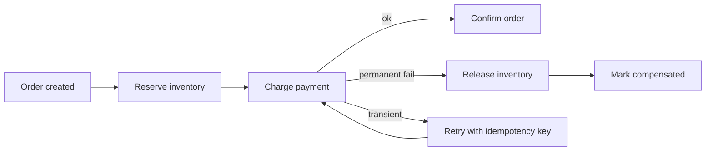

# Saga Compensation, Orchestration & Choreography

## Konu anlatımı
Bir business transaction birden fazla servis ve datastore'a yayıldığında tek ACID transaction sınırı kaybolur. Saga işi local transaction'lara böler; başarılı adımlar forward progress sağlar, daha sonraki bir adım kalıcı biçimde başarısız olursa önceki etkiler domain-specific compensating actions ile düzeltilir. Compensation klasik rollback değildir: arada başka işlemler gerçekleşmiş olabilir ve bazı side effect'ler tam tersine çevrilemez.

Choreography'de servisler event'lere tepki verir; az katılımcıda hafiftir ama dependency graph büyüdükçe akışı görmek zorlaşır. Orchestration'da coordinator state machine akışı açıkça yönetir; observability ve karmaşık branching kolaylaşır fakat orchestrator kritik bir bileşen olur.

## Mental model
Saga tek büyük `BEGIN/COMMIT` değil, durable business state machine'dir. Her transition için tekrar, timeout/unknown outcome ve compensation davranışı tanımlanır.

## İçeride ne oluyor?
1. Her participant kendi local transaction'ını commit eder; global rollback log yoktur.
2. Step sonucu durable workflow state/event olarak kaydedilir.
3. Timeout `failed` demek değildir; outcome unknown olabilir. Retry idempotent olmalı veya remote status sorgulanmalıdır.
4. Compensation business semantic'tir: refund, releaseReservation, cancelShipment; byte-level undo değildir.
5. Compensation'ın kendisi de fail/retry olabilir, progress durable tutulur.
6. Choreography event graph'ı dağıtır; orchestration transition logic'i coordinator'da görünür kılar.
7. Saga isolation sağlamaz; semantic locks, reservations veya version checks gerekebilir.
8. Irreversible side effect'ler mümkünse point-of-no-return sonrasına taşınır; human intervention yolu tasarlanır.

## Yüksek getirili mülakat soruları
1. Saga ile 2PC arasındaki temel trade-off nedir?
2. Compensation neden database rollback ile aynı değildir?
3. Choreography ve orchestration ne zaman seçilir?
4. Payment timeout'unda retry double-charge yaratmadan nasıl ilerlersin?
5. Compensation da başarısız olursa ne yaparsın?
6. Saga isolation eksikliğini inventory reservation örneğinde nasıl kontrol edersin?
7. Workflow platformu için durability, audit, ownership ve operability standardını nasıl belirlersin?

## Beklenen cevap seviyesi
- **Junior/Mid:** local transaction, eventual consistency, compensation, idempotency.
- **Senior:** unknown outcome, durable state, retries, semantic locks, irreversible steps.
- **Staff:** orchestration/choreography sınırları, workflow versioning, observability, blast radius.
- **Principal:** platform-vs-library kararı, domain ownership, audit/compliance, operational economics.

## Mini alıştırma
`CreateOrder -> ReserveInventory -> ChargePayment -> BookShipment` akışında her step için retry policy, idempotency key ve compensation yaz. Payment timeout'unda `failed` varsaymadan karar ağacı oluştur.

## Proje fikri
`saga-lab`: order/inventory/payment için üç küçük servis ve durable orchestrator kur. Deterministic failure injection ekle; retry, duplicate delivery, compensation ve orchestrator restart senaryolarını test et. Trace üzerinde saga ID ile uçtan uca akışı göster.

## Failure modes / trade-off / production bağlantısı
Duplicate message side effect'i iki kez çalıştırabilir; timeout unknown outcome yaratır; compensation irreversible external effect'i silemeyebilir; choreography dependency spaghetti'ye dönüşebilir; orchestrator state'i durable olmalıdır. Production'da stuck saga age, step retry count, compensation rate/failure, manual-intervention queue, end-to-end completion latency ve duplicate suppression metriği izlenmelidir.

## Kaynaklar
- AWS Prescriptive Guidance — Saga patterns: https://docs.aws.amazon.com/prescriptive-guidance/latest/cloud-design-patterns/saga-patterns.html
- AWS Prescriptive Guidance — Saga orchestration: https://docs.aws.amazon.com/prescriptive-guidance/latest/cloud-design-patterns/saga-orchestration.html
- Azure Architecture Center — Compensating Transaction: https://learn.microsoft.com/en-us/azure/architecture/patterns/compensating-transaction
