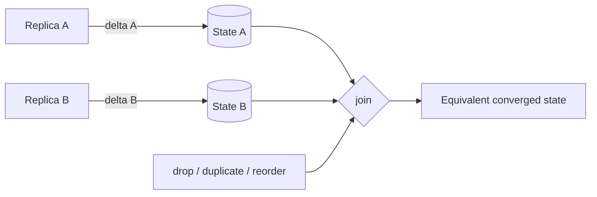

# CRDTs, Strong Eventual Consistency & Delta-State Replication

**Seviye:** Junior → Principal  
**Alan:** Distributed systems, databases, offline-first architecture

## Konu anlatımı
Network partition sırasında replica'lar bağımsız update kabul ediyorsa yeniden iletişim kurduklarında conflict resolution gerekir. Conflict-free Replicated Data Types (CRDT), belirli veri tiplerinde bu çözüm kuralını datatype'ın merge/operation semantiğine gömerek global coordination olmadan deterministik convergence sağlamayı amaçlar.

**State-based (CvRDT)** replica'lar state paylaşır. Merge bir join-semilattice üzerinde associative, commutative ve idempotent olduğunda duplicate/reordered state delivery convergence'ı bozmaz. **Operation-based (CmRDT)** update operasyonlarını yayar ve delivery varsayımları daha güçlüdür. **Delta-state CRDT** full state yerine küçük delta-state'ler üretip state-based join modelini koruyarak synchronization maliyetini azaltır.

## Mental model
CRDT 'çatışma oluşmaz' demek değildir; concurrent değişikliklerin sonucu veri tipinde önceden tanımlıdır. State-based merge'i küme birleşimi gibi düşün: aynı state parçasını iki kez görmek sonucu değiştirmemelidir. Delta-state ise her sync'te tüm kitabı değil yeni sayfaları göndermektir.

## Temel mekanikler
- **Strong eventual consistency:** aynı update kümesini görmüş doğru replica'lar eşdeğer state'e yakınsar.
- **G-Counter:** `replica_id -> monoton counter`; local replica yalnız kendi component'ini artırır, merge component-wise `max`, query toplamdır.
- **PN-Counter:** increment/decrement için iki grow-only counter'ın farkı.
- Remove içeren set'lerde yalnız element value yeterli değildir; observed-remove tasarımlarında unique tags/causal context hangi add'in remove tarafından görüldüğünü ayırır.
- State-based merge'de idempotence duplicate delivery'yi, commutativity reorder'ı, associativity merge grouping'i tolere etmeyi kolaylaştırır.
- Delta-state full-state bandwidth'ini azaltabilir; anti-entropy, delta retention ve causal delivery koşulları yine tasarlanmalıdır.
- CRDT convergence sağlar; global business invariant'larını otomatik sağlamaz.

## Mülakat soruları
1. Eventual consistency ile strong eventual consistency farkı nedir?
2. State-based merge neden idempotent olmalıdır?
3. G-Counter nasıl merge edilir?
4. PN-Counter decrement'i nasıl destekler?
5. OR-Set'te concurrent add/remove neden metadata ister?
6. Tombstone/identifier garbage collection neden zordur?
7. Staff: CRDT yerine ne zaman consensus/transaction seçersin?
8. Principal: offline-first product'ta convergence, delete semantics, invariant ve storage overhead'i nasıl yönetirsin?

## Beklenen cevap seviyesi
- **Junior:** replica, concurrent update, deterministic merge, convergence.
- **Mid:** G/PN-Counter, state-vs-op based, idempotent merge.
- **Senior:** causal context, observed-remove semantics, metadata growth, anti-entropy, invariants.
- **Staff:** CRDT/consensus boundary, multi-object correctness ve recovery.
- **Principal:** product semantics, compliance/delete requirements, topology, cost ve organization-wide consistency contracts.

## Mini alıştırma
A ve B G-Counter replica'ları partition sırasında sırasıyla 3 ve 2 increment yapsın. State mesajlarını duplicate ve ters sırada teslim et; component-wise `max` merge ile sonucun neden yine 5 olduğunu göster. Ardından aynı basit merge yaklaşımının add/remove set için neden yetersiz olduğunu açıkla.

## Proje fikri
`crdt-sync-lab`: üç replica'lı G-Counter ve observed-remove set simülatörü kur. Network mesaj drop/reorder/duplicate üretsin. Anti-entropy sonunda convergence property testi çalıştır; full-state ve delta-state modlarında transfer miktarını karşılaştır.

## Failure modes ve trade-off'lar
- Merge fonksiyonu algebraic properties'i sağlamazsa sessiz divergence oluşabilir.
- Replica IDs, tags veya tombstones sınırsız büyüyebilir.
- Causal metadata yanlış yönetilirse remove semantics bozulur.
- Garbage collection, geçmiş update'lerin artık geri gelemeyeceğini bilme problemi nedeniyle koordinasyon gerektirebilir.
- `balance >= 0`, global uniqueness, quota gibi invariant'lar yalnız convergence ile çözülmez.
- Delta propagation kötü tasarlanırsa beklenen bandwidth kazancı kaybolabilir.

## Production bağlantısı
Replica lag, anti-entropy bytes, merge duration, state/metadata size, tombstone ratio, convergence delay ve invariant-violation sinyalleri izlenmelidir. Product ekibiyle concurrent update semantiği açıkça tanımlanmalıdır; teknik convergence kullanıcı niyetiyle aynı şey değildir.

## Kaynaklar
- Shapiro et al. — Conflict-Free Replicated Data Types (SSS 2011): https://hal.science/inria-00609399
- Almeida, Shoker, Baquero — Delta State Replicated Data Types: https://arxiv.org/abs/1603.01529
- Preguiça, Baquero, Shapiro — Conflict-free Replicated Data Types overview: https://arxiv.org/abs/1805.06358
