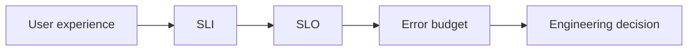

# SLI, SLO, SLA ve Error Budget

Bu bölüm SRE mülakatları için ölçümden mühendislik kararına giden zinciri anlatır.

## Kavramlar

- **SLI:** ölçülen sinyal; ör. başarı oranı, p99 latency, freshness.
- **SLO:** SLI için hedef.
- **SLA:** dış müşteriye verilen hizmet taahhüdü.
- **Error budget:** SLO ile %100 arasındaki izin verilen başarısızlık payı.

Amaç %100 peşinde koşmak değil; reliability ile feature velocity arasında bilinçli denge kurmaktır.

## Tail latency

Average latency tek başına yanıltıcıdır. p50 tipik deneyimi, p95/p99 ise kuyruğun yavaş tarafını gösterir. Fan-out yapan bir request'te tek yavaş dependency toplam p99'u büyütebilir.

## Kubernetes probe ilişkisi

- startup: uygulama başlatmayı tamamladı mı?
- readiness: trafik almaya uygun mu?
- liveness: process takıldı mı?

Dependency yavaşladı diye liveness fail ettirmek restart zinciri yaratabilir. Dependency failure ile process failure aynı şey değildir.

## Mülakat soruları

### Mid
1. SLI/SLO/SLA farkı nedir?
2. p99 neden önemlidir?
3. Availability nasıl ölçülür?

### Senior
1. Error budget release politikasını nasıl etkiler?
2. Hangi SLI'lar user-centric sayılır?
3. Retry ve queueing tail latency'yi nasıl etkiler?

### Staff / Principal
1. Multi-tenant platformda tek SLO yeterli midir?
2. Global metric bölgesel problemi nasıl gizleyebilir?
3. Shared platform reliability standardı nasıl kurulur?

## Lab

`mini-sre-lab`: `/fast`, `/slow`, `/flaky` endpoint'leri kur. Request rate, success rate, p50/p95/p99 ve basit error-budget tüketimini ölç.

## Habitat bağlantısı

Habitat-benzeri storage platformunda read/write success, p99 latency, routing error, replication lag, CDC freshness ve tenant throttling ayrı SLI'lar olabilir.

## Ana kaynaklar

- Google SRE — Service Level Objectives: https://sre.google/sre-book/service-level-objectives/
- Google SRE — Embracing Risk: https://sre.google/sre-book/embracing-risk/
- Kubernetes Probes: https://kubernetes.io/docs/concepts/configuration/liveness-readiness-startup-probes/
