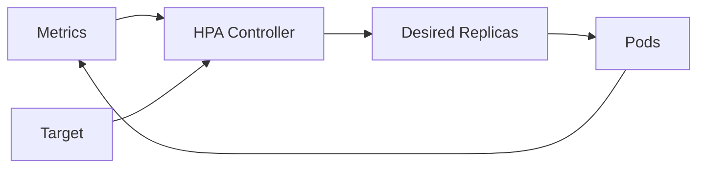

# Kubernetes HPA ve Control-Loop Thinking

Horizontal Pod Autoscaler, ölçeklenebilir workload'ların replica sayısını gözlenen metriklere göre periyodik biçimde ayarlayan bir controller'dır. Doğru mental model autoscaling'i basit threshold kuralı değil, gecikmeleri ve feedback'i olan bir control loop olarak görmektir.

## Neden yalnız CPU yetmez?

CPU compute-bound API için faydalı olabilir; queue worker için queue depth veya oldest-message age daha iyi talep sinyali olabilir. Startup süresi uzun servislerde metric lag ve readiness davranışı scale-up'ın kullanıcı latency'sine yetişememesine neden olabilir.

## Seviye beklentisi

Mid: horizontal/vertical scaling ve HPA'nın temel görevini açıkla. Senior: resource requests, readiness/startup, custom metrics, cold start ve downstream saturation bağlantısını kur. Staff: oscillation, stabilization, cost, regional capacity, SLO ve dependency limits üzerinden tasarımı değerlendir.

## Failure modes

Metric lag, oscillation, cold start, yanlış request değerleri, maxReplicas limiti, connection storm ve downstream saturation. Frontend pod sayısını artırmak database veya storage IOPS kapasitesini otomatik artırmaz.

## Habitat bağlantısı

Storage gateway katmanı request rate ile scale olabilir; fakat backend storage servislerinin quota, connection, throughput ve IOPS limitleri ayrı sinyaller olarak control plane'e taşınmalıdır. Aksi halde autoscaler darboğazı yalnızca aşağı katmana iter.

## Mini lab

Bir HTTP veya queue-worker servisini yük altında çalıştır. CPU ve queue-depth tabanlı iki scaling politikası simüle et. p95 latency, queue age, replica count ve maliyet eğrilerini karşılaştır.

## Kaynak

- Kubernetes Horizontal Pod Autoscaling resmi dokümanı: https://kubernetes.io/docs/concepts/workloads/autoscaling/horizontal-pod-autoscale/
