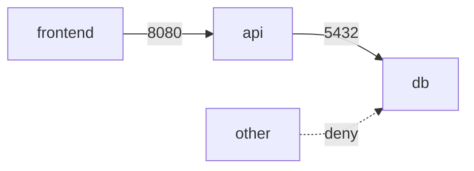

# Kubernetes NetworkPolicy

NetworkPolicy seçilen Pod'ların L3/L4 ingress ve egress akışlarını `podSelector`, `namespaceSelector` ve `ipBlock` gibi mekanizmalarla sınırlar. Resource'un varlığı tek başına enforcement değildir; network plugin'in NetworkPolicy uygulaması gerekir.

## Mental model
Önce workload'u isolate et, sonra gerekli akışları allow-list et. NetworkPolicy application-level authentication/authorization yerine geçmez.

## Production
Default-deny blast radius'i azaltır fakat DNS, telemetry veya control-plane dependency'lerini yanlışlıkla kesebilir. Label drift ve rollout sırasındaki eventual enforcement troubleshooting'i zorlaştırır. Multi-tenant platformlarda tenant/workload segmentation için güçlü bir katmandır.

## Kaynaklar
- https://kubernetes.io/docs/concepts/services-networking/network-policies/
- https://kubernetes.io/docs/reference/kubernetes-api/networking/network-policy-v1/
