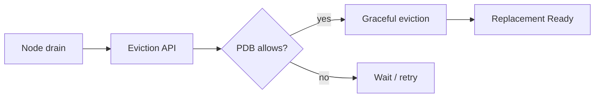

# Kubernetes PodDisruptionBudget ve Availability

PodDisruptionBudget (PDB), replicated workload'un voluntary eviction sırasında aynı anda ne kadar disruption tolere edeceğini tanımlar. `minAvailable` veya `maxUnavailable` kullanılır.

## Kritik ayrım
PDB bir uptime garantisi değildir. Node failure gibi involuntary disruption'ları önlemez. Bazı doğrudan silme işlemleri de PDB'yi bypass edebilir. Öte yandan aşırı katı bir budget node drain ve cluster upgrade'i bloke edebilir.

## Mülakat trade-off'ları
- quorum workload vs stateless API
- `minAvailable` vs `maxUnavailable`
- readiness ve termination grace period
- spare capacity ve pending replacement
- maintenance operability vs availability

## Failure modes
Yanlış selector, zero-disruption policy, yetersiz cluster capacity, uzun shutdown, unhealthy Pod eviction'ının bloke olması.

## Kaynaklar
- https://kubernetes.io/docs/concepts/workloads/pods/disruptions/
- https://kubernetes.io/docs/tasks/run-application/configure-pdb/
