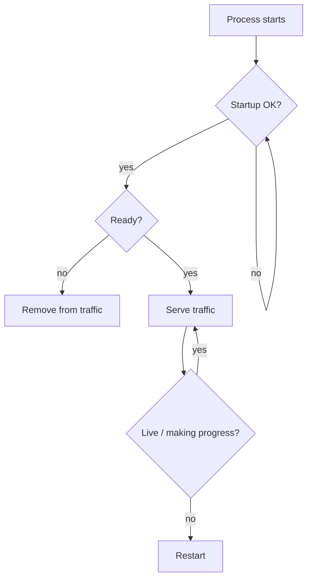

# Kubernetes Probes: Startup, Readiness, Liveness

## Mental model
- **startup:** uygulama başlangıç fazını tamamladı mı?
- **readiness:** bu Pod şu anda trafik almalı mı?
- **liveness:** proses restart gerektirecek biçimde ilerleyemiyor mu?

Startup probe başarıya ulaşana kadar liveness ve readiness kontrolleri başlamaz. Readiness başarısızlığı Pod'u Service endpoint trafiğinden çıkarır; liveness başarısızlığı eşik aşıldığında container restartına yol açar.

## Production tasarım ilkeleri
Dependency'nin geçici yavaşlığını doğrudan liveness'a bağlamak cascading restart üretebilir. Readiness trafik kabulü için daha uygun bir sinyaldir. Liveness yalnız restart'ın gerçekten iyileştireceği durumları hedeflemelidir. Slow-starting uygulamalarda startup probe, liveness threshold'unu anlamsız biçimde gevşetmeden başlangıç için ayrı bir pencere sağlar.

Probe endpoint'i düşük maliyetli olmalı; pahalı DB query veya çok sayıda downstream çağrı health mekanizmasının kendisini yük kaynağına dönüştürebilir.

## Mülakat soruları
1. Readiness ve liveness neden farklı semantics taşır?
2. DB kesintisi olduğunda liveness neden çoğu serviste başarılı kalmalıdır?
3. Startup probe hangi restart-loop problemini çözer?
4. Çok agresif threshold nasıl cascading failure yaratır?
5. Readiness düşürmek kapasiteyi hangi durumda daha da kötüleştirebilir?

## Alıştırma
90 saniyede açılan ve DB olmadan request işleyemeyen bir API için üç probe'un condition, period, timeout ve threshold politikasını tasarla.

## Habitat bağlantısı
Storage adapter'ın backend erişilebilirliği readiness sinyali olabilir; adapter prosesinin event-loop/deadlock gibi kendi ilerleme sağlığı liveness'tır. Böylece backend outage sırasında restart storm yerine kontrollü traffic removal uygulanabilir.

## Kaynaklar
- https://kubernetes.io/docs/concepts/workloads/pods/probes/
- https://kubernetes.io/docs/tasks/configure-pod-container/configure-liveness-readiness-startup-probes/
