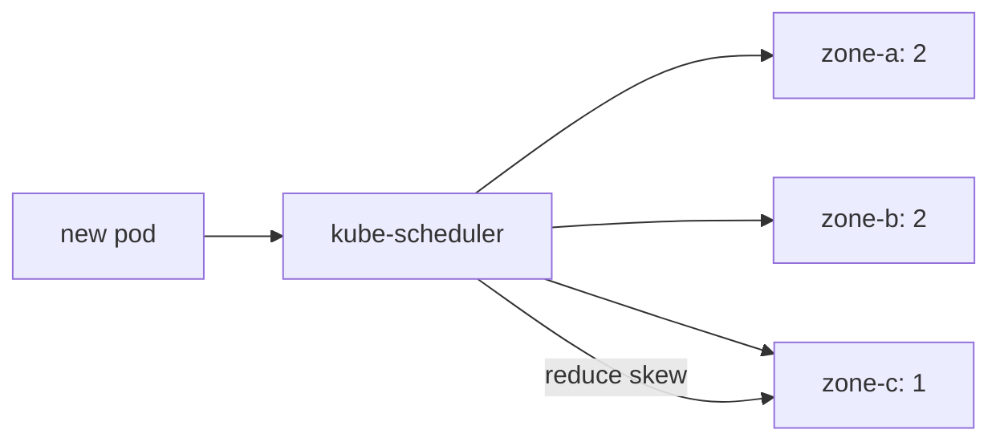

# Kubernetes Topology Spread, Failure Domains & Scheduling Trade-offs

## Konu anlatımı
Yüksek erişilebilirlik yalnız replica sayısı değil, replica'ların bağımsız failure domain'lere yerleşmesidir. Kubernetes `topologySpreadConstraints`, matching Pod'ların node/zone/region gibi topology domain'leri arasında dağılımını scheduler seviyesinde kontrol eder. `maxSkew` dengesizlik sınırıdır; `DoNotSchedule` hard, `ScheduleAnyway` soft yerleşim davranışı verir.

Topology spread, Pod anti-affinity ile aynı primitive değildir: anti-affinity belirli Pod'ların birlikte bulunmasını engellemek/azaltmak için uygundur; spread constraints sayısal dağılım hedefini ifade eder. Capacity, HPA, PDB ve zonal failure senaryoları aynı tasarımda değerlendirilmelidir.

## Mental model

## Mülakat soruları
- `maxSkew` neyi ifade eder?
- `DoNotSchedule` ile `ScheduleAnyway` trade-off'u nedir?
- Topology spread ile anti-affinity nasıl ayrılır?
- Zone kapasitesi bittiğinde hard constraint ne yapar?
- Staff: HPA + spread + PDB + capacity headroom nasıl tasarlanır?

## Beklenen cevap seviyesi
Mid: failure domain ve replica placement. Senior: selector, skew, hard/soft scheduling ve Pending failure mode. Staff: zonal headroom, autoscaling, disruption ve cluster-wide defaults.

## Mini alıştırma
3 zone ve 5 replica için `maxSkew: 1` dağılımı çiz; bir zone kapasitesizken hard/soft sonucu karşılaştır.

## Proje fikri
`topology-spread-lab`: üç sahte zone'da 2→9 replica scale ederek placement ve Pending davranışını gözlemle.

## Production / failure modes
Yanlış selector; aşırı katı constraint; zone spread yapıp node-level concentration'ı unutmak; HPA ile zonal capacity'nin uyuşmaması. Placement policy kapasite modelinin parçasıdır.

## Kaynaklar
- https://kubernetes.io/docs/concepts/scheduling-eviction/topology-spread-constraints/
- https://kubernetes.io/docs/concepts/scheduling-eviction/assign-pod-node/
