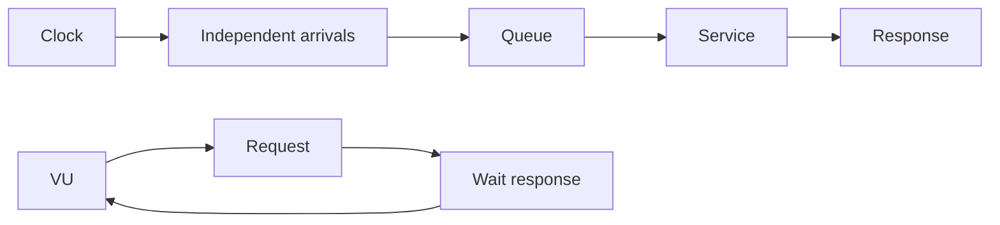

# Load Testing: Open/Closed Models, Queueing & Coordinated Omission

## Konu anlatımı
Load test yalnız maksimum RPS ölçümü değildir. Closed model'de yeni iş önceki işin bitişine bağlıdır; sistem yavaşladıkça generator da yavaşlayabilir. Open model arrival'ları response completion'dan bağımsız planlar. Model seçimi gerçek workload'un arrival mekanizmasına dayanmalıdır.

Kararlı queueing mental modelinde Little's Law `L = λ × W` average concurrency, throughput ve response time'ı ilişkilendirir. Tail latency için p50/mean yeterli değildir. Coordinated omission, generator'ın yavaş response sırasında yeni request üretmeyi durdurması nedeniyle kötü latency dönemlerinde sample kaçırmasıdır.

## İçeride ne oluyor?
- Closed-loop: concurrency sabitlenebilir, throughput latency arttıkça düşebilir.
- Open-loop/arrival-rate: arrival schedule response completion'dan ayrılır.
- Generator capacity yetmezse dropped iterations önemlidir.
- Mean latency tail'i saklar; histogram/percentile gerekir.
- Coordinated omission stall/GC pause/queue collapse ölçümünü iyimser gösterebilir.
- Warm-up, connection reuse, cache state, dataset size ve duration sonucu değiştirir.
- Load/stress/spike/soak farklı failure mode'larını hedefler.

## Mülakat soruları
1. Load test ile stress test farkı nedir?
2. Open ve closed workload model farkı nedir?
3. Little's Law neyi ilişkilendirir?
4. p99 neden average latency'den farklıdır?
5. Coordinated omission nedir?
6. Generator saturation ile SUT saturation nasıl ayrılır?
7. Capacity testinden autoscaling policy'sine nasıl çıkarım yapılır?
8. Regional failure için headroom nasıl modele girer?

## Beklenen cevap seviyesi
- **Mid:** throughput, latency, concurrency, percentile, test türleri.
- **Senior:** open/closed model, queueing, coordinated omission, warm-up, attribution.
- **Staff:** SLO-derived workload, autoscaling, dependency saturation, failure injection.
- **Principal:** capacity economics, regional loss, demand growth, cost/risk.

## Mini alıştırma
2.000 req/s ve 50 ms average response time için Little's Law ile average in-flight sayısını hesapla. Latency 500 ms'ye çıkarken arrival rate sabit kalırsa tekrar hesapla; closed-loop generator ile farkını açıkla.

## Proje fikri
`latency-lab`: aynı HTTP servisini k6 constant-VUs ve constant-arrival-rate ile test et. Kontrollü stall enjekte et; throughput, dropped iterations ve p50/p95/p99'i karşılaştır. HdrHistogram ile coordinated-omission etkisini incele.

## Failure modes / production bağlantısı
Generator bottleneck'ini SUT bottleneck'i sanmak, yalnız mean/p50 raporlamak, gerçekçi olmayan cache/connection state kullanmak ve closed-loop sonucu independent-arrival workload'a genellemek yaygın hatalardır. Arrival rate, queue depth, dependency limits, autoscaling lag, saturation ve p99 birlikte okunmalıdır.

## Kaynaklar
- Grafana k6 — Open and closed models: https://grafana.com/docs/k6/latest/using-k6/scenarios/concepts/open-vs-closed/
- Grafana k6 — Scenarios: https://grafana.com/docs/k6/latest/using-k6/scenarios/
- HdrHistogram: https://github.com/HdrHistogram/HdrHistogram
- Google SRE Workbook — Load Testing: https://sre.google/workbook/load-testing/
