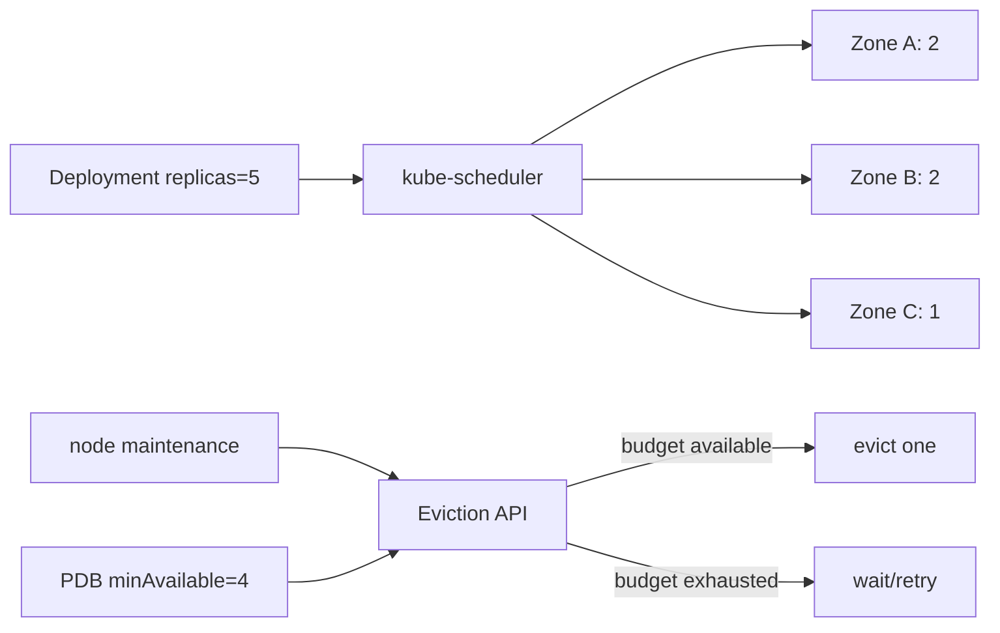

# Kubernetes Failure Domains, Topology Spread & PodDisruptionBudget

**Seviye:** Mid → Principal

## Konu anlatımı
Yüksek erişilebilirlik yalnız `replicas: 3` değildir. Replica'lar aynı node veya zone'daysa tek failure domain bütün kopyaları etkileyebilir. Kubernetes topology spread constraints pod'ların node/zone gibi domain'lere dağılımını kontrol eder; PodDisruptionBudget (PDB) ise Eviction API üzerinden voluntary disruption sırasında aynı anda ne kadar serving capacity kaybedilebileceğini sınırlar.

PDB placement mekanizması değildir. Topology spread de disruption budget değildir. Production tasarımında placement, spare capacity, readiness, graceful termination ve disruption policy birlikte ele alınır.

## İçeride ne oluyor?
- `topologySpreadConstraints` matching pod sayılarını topology domain'leri arasında dengeler; `maxSkew` izin verilen dengesizliği sınırlar.
- `DoNotSchedule` hard constraint, `ScheduleAnyway` soft preference'tır.
- PDB `minAvailable` veya `maxUnavailable` ile voluntary eviction concurrency'sini sınırlar.
- PDB involuntary node/cloud failure'ını engellemez.
- Eviction API PDB'yi dikkate alır; doğrudan object deletion aynı korumayı sağlamayabilir.
- Quorum tabanlı stateful sistemlerde budget quorum matematiğine göre seçilmelidir.
- Aşırı katı PDB node drain/upgrade'i kilitleyebilir; replacement pod için kapasite gerekir.

## Yüksek getirili mülakat soruları
1. Üç replica neden HA garantisi değildir?
2. Pod anti-affinity ile topology spread farkı nedir?
3. PDB hangi failure'ları kapsar?
4. `minAvailable` ile `maxUnavailable` nasıl seçilir?
5. Senior: 5 üyeli quorum sisteminde drain politikasını tasarla.
6. Staff: autoscaler, PDB ve spread constraints nasıl unschedulable/deadlock benzeri operasyonel durum yaratır?
7. Principal: N+1 zone kapasitesini availability ve maliyetle nasıl dengelersin?

## Seviyeye göre cevap derinliği
- **Mid:** replica, node/zone failure domain, spread ve PDB ayrımı.
- **Senior:** readiness, drain, quorum, headroom ve graceful termination.
- **Staff/Principal:** scheduler/autoscaler etkileşimi, maintenance throughput, blast radius ve availability economics.

## Kısa alıştırma
3 zone'da 5 replica için `maxSkew: 1` dağılımını çiz. `minAvailable: 4` ile aynı anda kaç voluntary eviction yapılabileceğini hesapla. Bir zone kaybolduğunda PDB'nin neden sistemi kurtaramadığını açıkla.

## Proje fikri
`k8s-disruption-lab`: 5 replica HTTP servisine topology spread + PDB ekle. Node drain sırasında ready replica, eviction wait ve request error rate ölç. Sonra bir zone kapasitesini kaldırıp scheduler/availability davranışını karşılaştır.

## Failure modes / trade-off / production bağlantısı
PDB'yi HA garantisi sanmak, replica'ları tek zone'da bırakmak, `maxUnavailable: 0` ile maintenance'ı kilitlemek, readiness'i gerçek serving capacity'den koparmak ve replacement capacity bırakmamak tipik hatalardır. Production'da ready replicas, PDB `disruptionsAllowed`, pending pods, zone dağılımı, drain süresi, eviction rejection ve SLO error budget birlikte izlenir.

## Kaynaklar
- Kubernetes — Disruptions: https://kubernetes.io/docs/concepts/workloads/pods/disruptions/
- Kubernetes — Pod Topology Spread Constraints: https://kubernetes.io/docs/concepts/scheduling-eviction/topology-spread-constraints/
- Kubernetes — Configure a PodDisruptionBudget: https://kubernetes.io/docs/tasks/run-application/configure-pdb/
- Kubernetes API — PodDisruptionBudget: https://kubernetes.io/docs/reference/kubernetes-api/policy/pod-disruption-budget-v1/
