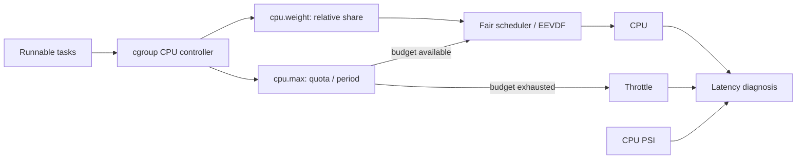

# cgroup CPU Control, Throttling, PSI & Scheduler Latency

## Neden önemli?
Container ve Kubernetes ortamında CPU problemi yalnız “CPU yüzde kaç?” değildir. Task runnable olduğu halde scheduler sırası, cgroup bandwidth sınırı veya resource contention yüzünden bekleyebilir. Tail-latency teşhisinde scheduler ile resource-control katmanlarını ayırmak gerekir.

## Mental model

Scheduler kapısı **hangi runnable task?**, cgroup budget kapısı ise **bu grup şu anda CPU kullanabilir mi?** sorusunu cevaplar.

## Temel mekanizmalar
- `cpu.weight`: sibling cgroup'lar arasında göreli, work-conserving CPU payı. cgroup v2 aralığı 1–10000, varsayılan 100'dür.
- `cpu.max`: `$MAX $PERIOD`; grup her period içinde en fazla MAX kadar CPU zamanı tüketebilir. `max` limitsiz anlamına gelir.
- `cpu.stat`: CPU usage ve throttling gözlemlerini taşır; hierarchy nedeniyle ancestor limitleri de descendant davranışını etkileyebilir.
- EEVDF: modern Linux fair-scheduling hattında lag/eligibility ve virtual deadline ile runnable task seçimini şekillendirir. Cgroup bandwidth control ile aynı mekanizma değildir.
- PSI: CPU/memory/I/O scarcity nedeniyle task'ların stall olduğu zamanı ölçer. `/proc/pressure/*` system-wide; cgroup v2 altında `cpu.pressure`, `memory.pressure`, `io.pressure` workload seviyesinde görünürlük sağlar.

## Debugging sırası
1. Application p50/p99 ve throughput değişimini doğrula.
2. Host CPU utilization ve runnable queue'yu kontrol et.
3. Workload'un effective cgroup hierarchy'sini ve `cpu.max`/`cpu.weight` değerlerini bul.
4. `cpu.stat` throttling değişimini ölç.
5. CPU PSI ile gerçek stall zamanını korele et.
6. Ancestor cgroup quota ve co-located noisy-neighbor ihtimalini kontrol et.
7. Limit değişikliğini kontrollü deneyle doğrula; yalnız utilization grafiğine bakarak root cause ilan etme.

## Mülakat soruları
1. `nice`, `cpu.weight` ve `cpu.max` farkı nedir?
2. Node CPU'su boş görünürken container nasıl throttled olabilir?
3. Quota/period burstiness p99'u nasıl etkiler?
4. CPU PSI ne ölçer, neyi kanıtlamaz?
5. Request-serving ve batch workload aynı node'da nasıl izole edilir?
6. Ancestor cgroup limiti production incident'ında nasıl bulunur?

## Seviye beklentisi
- **Junior/Mid:** runnable/scheduled/throttled ayrımını ve weight-vs-quota farkını bilir.
- **Senior:** quota-period, PSI, noisy neighbor ve tail latency korelasyonunu teşhis eder.
- **Staff/Principal:** hierarchy, SLO, capacity policy, workload classes ve rollout/blast-radius yönetimini tartışır.

## Mini alıştırma
`cpu.max = 200000 100000` teorik olarak iki CPU-core eşdeğeri bandwidth tavanıdır. p99 yükselirken node CPU %55 fakat throttled time ve CPU PSI artıyorsa host-level utilization'ın neden yetersiz sinyal olduğunu açıklayıp doğrulama planı çıkar.

## Proje
`cpu-pressure-lab`: cgroup v2 altında latency-sensitive server ve CPU-bound batch job çalıştır. `cpu.weight`/`cpu.max` kombinasyonlarını değiştir; throughput, p50/p99, `cpu.stat`, system/per-cgroup PSI ölç ve bir incident runbook'u üret.

## Failure modes / trade-off
Sıkı quota isolation sağlar ama burst'leri kesip latency'yi artırabilir. Weight contention altında paylaşımı etkiler fakat kapasite garantisi değildir. PSI scarcity etkisini ölçer ama tek başına hangi process veya policy'nin root cause olduğunu söylemez. Container platformlarında request/limit policy'sini kernel davranışıyla bağlamadan tuning yapmak sahte güven yaratır.

## Kaynaklar
- Linux Kernel — Control Group v2: https://docs.kernel.org/admin-guide/cgroup-v2.html
- Linux Kernel — PSI: https://docs.kernel.org/accounting/psi.html
- Linux Kernel — EEVDF Scheduler: https://docs.kernel.org/scheduler/sched-eevdf.html
