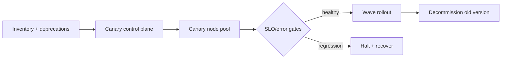

# Kubernetes Patch Lifecycle, Version Skew & Safe Fleet Upgrades

## Neden önemli?
Kubernetes upgrade, control plane, kubelet, kube-proxy, CNI/CSI, admission webhook ve workload'ların farklı hızlarda hareket ettiği geçici bir heterogeneous distributed-system durumudur. Güvenli model: **support window + version-skew contract + staged rollout + recovery budget**.

## Mental model

## İçeride ne oluyor?
Upgrade öncesi API/deprecation ve addon compatibility envanteri çıkarılır. Control plane ve node'lar version-skew policy içinde ilerletilir; node drain ve PodDisruptionBudget davranışı canary'de sınanır. Başarı yalnız `NodeReady` değildir: workload SLO, scheduling latency, admission, DNS/networking, storage attach ve autoscaling sinyalleri promotion gate olmalıdır.

## Mülakat soruları
1. Version skew neden önemlidir?
2. Control plane ve worker hangi sırayla upgrade edilir?
3. PDB neyi garanti eder, neyi etmez?
4. Deprecated API kullanımı nasıl bulunur?
5. Fleet rollout wave/blast radius nasıl tasarlanır?
6. EOL yaklaşan sürümler için exception policy nasıl kurulur?

## Beklenen cevap seviyesi
- **Mid:** drain, PDB, control-plane/worker ve compatibility.
- **Senior:** API deprecation, addons/webhooks, storage/network, canary/SLO.
- **Staff:** fleet inventory, wave rollout, automated halt ve exceptions.
- **Principal/CTO:** lifecycle'ı risk, compliance, capacity ve platform economics ile bağlar.

## Mini alıştırma
120 node cluster için aynı anda en fazla %5 unavailable olacak wave planı ve Ready/scheduling/5xx/DNS/storage halt gate'leri tasarla.

## Proje fikri
`cluster-upgrade-guard`: version/addon inventory, deprecated API raporu ve canary SLO gate'leriyle promote/halt kararı üreten CLI/controller.

## Failure modes / trade-off
Tüm node'ları aynı anda drain etmek, PDB'yi capacity garantisi sanmak, addon/webhook compatibility'sini atlamak ve yalnız NodeReady izlemek tipik hatalardır. Küçük wave blast radius'u azaltır ama rollout süresini uzatır.

## Production bağlantısı
Version distribution, deprecated API calls, drain duration, unschedulable pods, admission/DNS/network/storage hataları ve workload SLO'ları izlenmelidir.

## Kaynaklar
- Kubernetes releases: https://kubernetes.io/releases/
- Patch releases: https://kubernetes.io/releases/patch-releases/
- Version Skew Policy: https://kubernetes.io/releases/version-skew-policy/
- Disruptions / PDB: https://kubernetes.io/docs/concepts/workloads/pods/disruptions/
