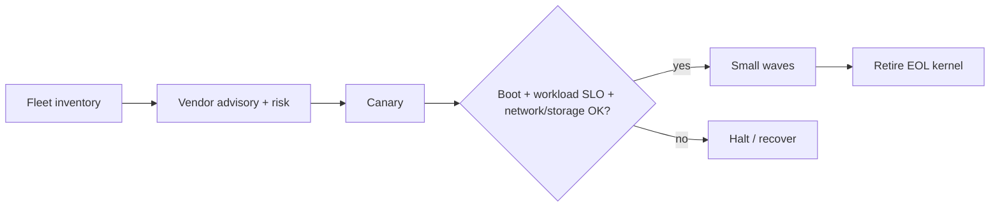

# Linux LTS Kernel Lifecycle, Backports & Fleet Patch Strategy

## Neden önemli?
Kernel scheduler, memory, filesystem, networking, drivers, eBPF ve syscall ABI gibi bütün host failure domain'ini etkiler. kernel.org aktif release tablosunda 6.18 ve 6.12 longterm tree'leri Aralık 2028'e; 5.15 ve 5.10 ise Aralık 2026'ya kadar projected EOL ile listelenir. Kernel lifecycle bu yüzden security exposure ve platform debt girdisidir.

## Mental model

**Invariant:** patch success yalnız reboot başarısı değildir; workload davranışı da kabul edilebilir kalmalıdır.

## LTS ve backport
Longterm tree'ler önemli bugfix'leri backport eder. Distribution kernel'ları upstream tree ile aynı patch setine sahip olmak zorunda değildir. Bu nedenle `uname -r` tek başına CVE exposure kanıtı değildir; distribution/vendor advisory ve package metadata kaynak-of-truth olmalıdır.

## Fleet rollout
1. Kernel/distro/package inventory çıkar.
2. Security advisory ve compatibility etkisini değerlendir.
3. Temsilî canary host/node pool seç.
4. Boot, CNI/CSI/eBPF/driver ve workload SLO'larını doğrula.
5. Capacity budget'a göre küçük wave'lerle ilerle.
6. Otomatik halt ve recovery koşulları tanımla.
7. EOL kernel'leri exception owner ve deadline ile kapat.

## Mülakat soruları
1. LTS kernel nedir?
2. Backport nedir ve version string neden yetersizdir?
3. Canary workload nasıl seçilir?
4. Reboot vs live patch trade-off'u nedir?
5. Kubernetes drain/PDB/capacity kernel patching'i nasıl etkiler?
6. eBPF/CNI/CSI/driver compatibility nasıl test edilir?
7. 10 bin host için wave ve automated halt nasıl tasarlanır?
8. CTO seviyesinde EOL kernel borcu nasıl yönetilir?

## Seviyeye göre cevap
- **Junior:** kernel/userspace, reboot, LTS.
- **Mid:** backport, distro kernel, module/driver, canary.
- **Senior:** workload-aware rollout, drain, recovery, telemetry.
- **Staff/CTO:** fleet policy, EOL budget, compliance, exception ownership ve economics.

## Alıştırma
2.000 Kubernetes worker'ın %20'si 5.15 tabanlı distro kernel kullanıyor ve aynı anda en fazla %2 capacity kaybı kabul ediliyor. Canary/wave planı, halt koşulları ve advisory doğrulamasını tasarla.

## Proje
`kernel-fleet-auditor`: VM/node kernel ve distro package bilgisini toplayıp support/EOL sınıfı, reboot-required durumu, canary adayları ve rollout waves çıkarır.

## Failure modes / production
Version string'i vulnerability status sanmak, distro backport'larını yok saymak, tek-wave reboot, yalnız host health bakmak ve driver/CNI/CSI/eBPF regression'ını test etmemek tipik hatalardır. Live patch downtime'ı azaltabilir fakat bütün değişiklikleri kapsamaz ve karmaşıklık ekler. Version distribution, reboot age, node readiness, boot failure, kernel oops/panic, packet loss, storage errors ve workload p95/p99 izlenmelidir.

## Kaynaklar
- https://www.kernel.org/releases.html
- https://docs.kernel.org/
- https://docs.kernel.org/admin-guide/reporting-issues.html
