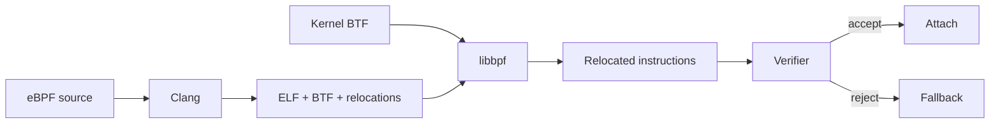

# eBPF Verifier, BTF & CO-RE Portability

## Konu anlatımı
eBPF, kernel hooks üzerinde sandboxed programlar çalıştırarak networking, tracing, observability ve security policy gibi alanlarda programlanabilirlik sağlar. Güvenlik gate'i **verifier**'dır: program load sırasında control flow, register/stack state, pointer türleri, bounds ve helper/kfunc argümanları analiz edilir. Kabul edilmeyen program attach edilmez.

Kernel struct layout'ları sürümler arasında değişebildiği için safety'den ayrı bir portability problemi vardır. **BTF** kernel/program type metadata'sını taşır. **CO-RE (Compile Once — Run Everywhere)** compiler relocation metadata'sı, BTF ve libbpf loader'ı birleştirir; hedef kernel'in gerçek layout'una göre BPF instruction offset/immediate alanları load-time'da düzeltilir.

CO-RE bir kernel ABI garantisi değildir. Type/field kaybolabilir, attach target veya kfunc contract değişebilir. Kernel BPF Design Q&A arbitrary kernel function attach noktalarının ABI olmadığını belirtir. Bu nedenle feature detection, verifier-log observability ve graceful fallback production contract'ının parçasıdır.

## Mental model

**Invariant:** CO-RE portability problemini; verifier safety problemini çözer.

## İçeride ne oluyor?
Verifier instruction path'lerinde register ve stack state'i izler; pointer provenance/range bilgisi olmadan unsafe memory access'i reddeder. BTF type/function/line metadata sağlar. CO-RE relocation records `.BTF.ext` içinde tutulur; libbpf bunları running kernel BTF ile eşleştirerek load öncesi instruction alanlarını patch eder.

## Mülakat soruları
1. Verifier neden load-time state tracking yapar?
2. Pointer ve scalar ayrımı neden önemlidir?
3. BTF ne sağlar?
4. CO-RE relocation neyi çözer?
5. CO-RE neden ABI garantisi değildir?
6. Verifier rejection nasıl graceful degrade edilir?
7. Beş kernel ailesinde rollout matrix'i nasıl kurarsın?
8. Verifier bypass bug'ının blast radius'u neden yüksektir?

## Beklenen cevap seviyesi
- **Mid:** hook, map, verifier ve temel safety modeli.
- **Senior:** BTF/CO-RE, bounds/pointer tracking ve compatibility.
- **Staff:** kernel matrix, capability detection, fallback, rollout ve isolation.

## Mini alıştırma
Packet parser'da `data + 14 <= data_end` check'i olmadan Ethernet header read'inin neden reddedilmesini beklediğini açıkla. Ardından üç kernel sürümü için compatibility/fallback matrisi tasarla.

## Proje fikri
`core-probe`: CO-RE process/network tracer; BTF/capability preflight, verifier-log capture, ring-buffer export ve unsupported-host fallback metriği ekle.

## Failure modes / trade-off / production
Verifier complexity rejection yaratabilir; type/field/attach değişimi relocation veya attach failure doğurabilir; event storm ring-buffer drop ve CPU overhead üretir; privileged loader compromise büyük blast radius taşır. Load/attach success, verifier reason, lost events, map pressure, CPU overhead, kernel/BTF distribution ve fallback rate izlenmelidir. Kill switch ve overhead budget zorunlu production guardrail'leridir.

## Kaynaklar
- Linux Kernel — verifier: https://docs.kernel.org/bpf/verifier.html
- Linux Kernel — BTF: https://docs.kernel.org/bpf/btf.html
- Linux Kernel — CO-RE relocations: https://docs.kernel.org/bpf/llvm_reloc.html
- Linux Kernel — BPF Design Q&A: https://docs.kernel.org/bpf/bpf_design_QA.html
