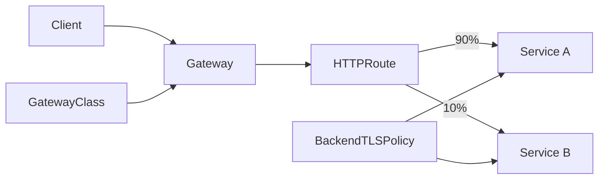

# Kubernetes Gateway API, Policy Attachment & Safe Traffic Control

## Neden önemli?
Gateway API, Kubernetes L4/L7 traffic yönetiminde infrastructure ownership ile application routing'i ayırır. Temel zincir `GatewayClass → Gateway → Route → backend` şeklindedir. Platform ekibi shared listener/TLS/controller sınırını, uygulama ekibi route intent'ini yönetebilir.

Gateway API v1.4.0 6 Ekim 2025'te yayımlandı. Gateway, GatewayClass ve HTTPRoute GA/Standard yüzeylerdir. v1.4'te BackendTLSPolicy Standard kanala çıkarak gateway→backend TLS doğrulamasını standartlaştırdı; `supportedFeatures` ise controller capability discovery/conformance için status yüzeyi sağlar.

## Mental model

## Production ilkeleri
- `Accepted`, `Programmed`, `ResolvedRefs` conditions'i yalnız manifest apply başarısından daha değerlidir.
- Retry, timeout ve mirroring failure amplification yaratabilir; retry budget ve deadline ile sınırla.
- Weighted routing canary'de error rate yanında p95/p99 ve saturation rollback guardrail'ı olmalıdır.
- Cross-namespace reference explicit trust ister; delegation ile privilege boundary'yi karıştırma.
- Standard ve Experimental feature'ları ayır; controller'ın `supportedFeatures`/conformance bilgisini kontrol et.

## Mülakat soruları
1. Ingress ile Gateway API ownership modeli nasıl farklıdır?
2. GatewayClass/Gateway/HTTPRoute sorumluluklarını ayır.
3. BackendTLSPolicy hangi hop'u korur?
4. Retry budget overload'u nasıl sınırlar?
5. Cross-namespace routing'i nasıl güvenli tasarlarsın?
6. Multi-controller portability'yi nasıl test edersin?

## Failure modes / trade-off
Yanlış listener binding, unresolved backendRef, aşırı retry, unsafe mirror, cross-namespace trust açığı ve implementation-specific extension'a bağımlılık tipiktir. Daha merkezi policy tutarlılığı artırır fakat uygulama ekiplerinin velocity'sini azaltabilir; delegation sınırı explicit olmalıdır.

## Production telemetry
Route condition'ları, RPS, p95/p99, 4xx/5xx, retry count, backend TLS failure, saturation, canary cohort ve controller reconcile latency izlenir.

## Kaynaklar
- Kubernetes Gateway API v1.4: https://kubernetes.io/blog/2025/11/06/gateway-api-v1-4/
- Gateway API docs: https://gateway-api.sigs.k8s.io/
- Specification: https://gateway-api.sigs.k8s.io/reference/spec/
- Gateway API v1.3 / retry budgets: https://kubernetes.io/blog/2025/06/02/gateway-api-v1-3/
