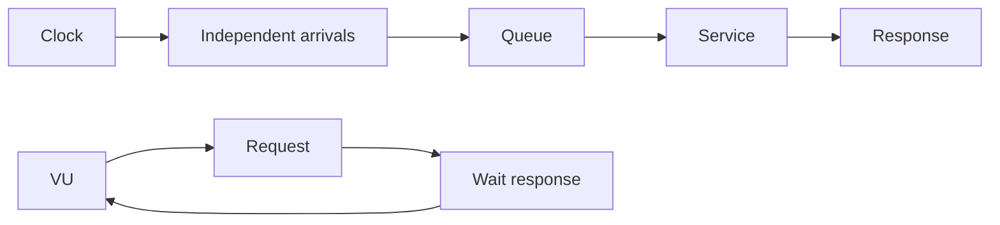

# Load Testing: Open/Closed Models, Queueing & Coordinated Omission

## Konu anlatımı
Load test yalnız “kaç RPS kaldırıyor?” sorusu değildir. Closed model'de yeni iş önceki işin bitişine bağlıdır; sistem yavaşladıkça generator da yavaşlar. Open model arrival'ları response completion'dan bağımsız planlar. Doğru seçim workload'un gerçek arrival mekanizmasına göre yapılmalıdır.

Kararlı queueing mental modelinde Little's Law `L = λ × W` ile average concurrency, throughput ve response time'ı bağlar. Tail latency için p50 yeterli değildir. Coordinated omission, generator'ın yavaş response sırasında yeni request üretmeyi durdurması nedeniyle kötü latency dönemlerinde sample kaçırması ve sonucu iyimser göstermesidir.

## İçeride ne oluyor?
- Closed-loop test concurrency'yi sabit tutabilir; throughput sistem yavaşladıkça düşer.
- Arrival-rate/open-loop test hedef arrival rate'i zamana göre üretmeye çalışır.
- Generator kapasitesi yetersizse dropped iterations test sonucunun parçasıdır.
- Mean latency tail'i saklayabilir; histogram ve percentiles gerekir.
- Coordinated omission stall/GC pause/queue collapse sırasında ölçümü iyimser gösterebilir.
- Warm-up, connection reuse, cache state, dataset size ve test duration sonucu değiştirir.
- Load, stress, spike ve soak test farklı failure mode'ları hedefler.

## Mülakat soruları
1. Load test ile stress test farkı nedir?
2. Open ve closed workload model farkı nedir?
3. Little's Law neyi ilişkilendirir?
4. p99 neden average latency'den farklı bilgi verir?
5. Coordinated omission nedir?
6. Senior: generator saturation ile SUT saturation nasıl ayrılır?
7. Staff: capacity testinden autoscaling policy'sine nasıl güvenli çıkarım yapılır?
8. Principal: regional failure için capacity headroom nasıl modele girer?

## Seviyeye göre cevap derinliği
- **Mid:** throughput, latency, concurrency, percentile ve test türleri.
- **Senior:** open/closed model, queueing, coordinated omission, warm-up ve attribution.
- **Staff:** SLO-derived workload, autoscaling, headroom, dependency saturation ve failure injection.
- **Principal:** capacity economics, regional loss, demand growth ve cost/risk.

## Mini alıştırma
Sistem 2.000 req/s alıyor ve average response time 50 ms. Little's Law ile average in-flight request sayısını hesapla. Latency 500 ms'ye çıkarken arrival rate sabit kalırsa concurrency baskısını yeniden hesapla; closed-loop generator ile farkı açıkla.

## Proje fikri
`latency-lab`: aynı HTTP servisini k6 constant-VUs ve constant-arrival-rate ile test et. Kontrollü 500 ms stall enjekte et; throughput, dropped iterations ve p50/p95/p99'i karşılaştır. HdrHistogram ile coordinated-omission etkisini incele.

## Failure modes / trade-off / production
Laptop testinden production kapasitesi çıkarmak, generator bottleneck'ini SUT bottleneck'i sanmak, yalnız average/p50 raporlamak, unrealistic cache/connection state kullanmak ve closed-loop sonucu independent-arrival workload'a genellemek tipik hatalardır. Production'da arrival rate, queue depth, dependency limits, autoscaling lag, saturation ve p99 birlikte okunmalıdır.

## Kaynaklar
- Grafana k6 — Open and closed models: https://grafana.com/docs/k6/latest/using-k6/scenarios/concepts/open-vs-closed/
- Grafana k6 — Scenarios: https://grafana.com/docs/k6/latest/using-k6/scenarios/
- HdrHistogram: https://github.com/HdrHistogram/HdrHistogram
- Google SRE Workbook — Load Testing: https://sre.google/workbook/load-testing/